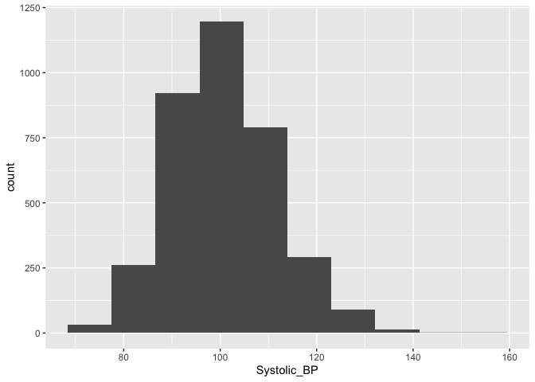
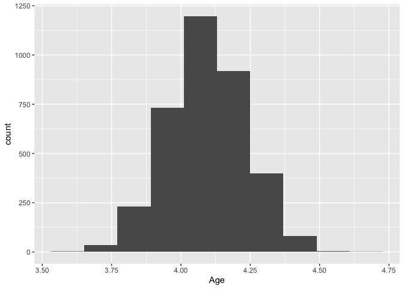
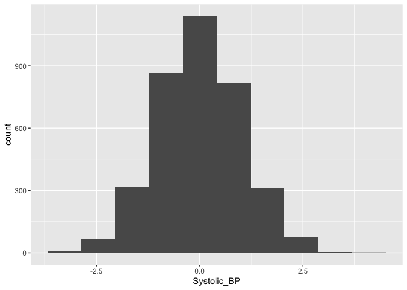
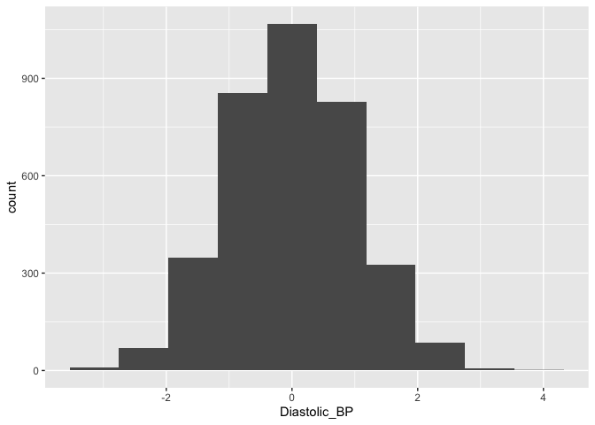
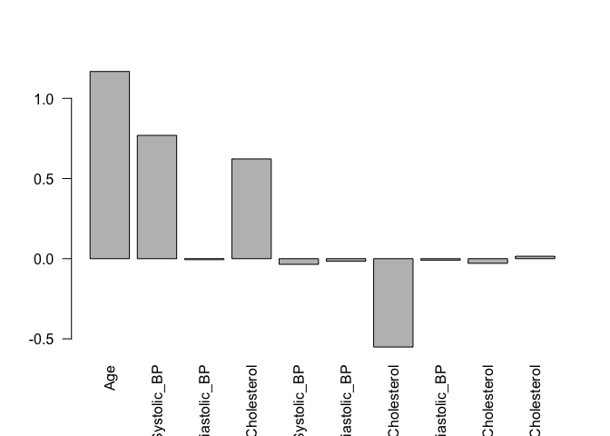

Week 1 Assignment: Build and Evaluate a Linear Risk model - using R
================
Juan Li (based on python code on Github)
04/29/2022

-   <a href="#overview-of-the-assignment"
    id="toc-overview-of-the-assignment">Overview of the Assignment</a>
    -   <a href="#diabetic-retinopathy" id="toc-diabetic-retinopathy">Diabetic
        Retinopathy</a>
    -   <a href="#logistic-regression" id="toc-logistic-regression">Logistic
        Regression</a>
-   <a href="#import-packages" id="toc-import-packages">Import Packages</a>
-   <a href="#load-data" id="toc-load-data">Load Data</a>
-   <a href="#explore-the-dataset" id="toc-explore-the-dataset">Explore the
    Dataset</a>
-   <a href="#mean-normalize-the-data"
    id="toc-mean-normalize-the-data">Mean-Normalize the Data</a>
    -   <a href="#exercise-1" id="toc-exercise-1">Exercise 1</a>
-   <a href="#build-the-model" id="toc-build-the-model">Build the Model</a>
    -   <a href="#exercise-2" id="toc-exercise-2">Exercise 2</a>
-   <a href="#evaluate-the-model-using-the-c-index"
    id="toc-evaluate-the-model-using-the-c-index">Evaluate the Model Using
    the C-index</a>
    -   <a href="#exercise-3" id="toc-exercise-3">Exercise 3</a>
-   <a href="#evaluate-the-model-on-the-test-set"
    id="toc-evaluate-the-model-on-the-test-set">Evaluate the Model on the
    Test Set</a>
-   <a href="#improve-the-model" id="toc-improve-the-model">Improve the
    Model</a>
    -   <a href="#exercise-4" id="toc-exercise-4">Exercise 4</a>
-   <a href="#evaluate-the-improved-model"
    id="toc-evaluate-the-improved-model">Evaluate the Improved Model</a>
-   <a href="#congratulations" id="toc-congratulations">Congratulations!</a>

Welcome to the first assignment in Course 2!

# Overview of the Assignment

In this assignment, you’ll build a risk score model for retinopathy in
diabetes patients using logistic regression.

As we develop the model, we will learn about the following topics:

-   Data preprocessing
    -   Log transformations
    -   Standardization
-   Basic Risk Models
    -   Logistic Regression
    -   C-index
    -   Interactions Terms

## Diabetic Retinopathy

Retinopathy is an eye condition that causes changes to the blood vessels
in the part of the eye called the retina. This often leads to vision
changes or blindness. Diabetic patients are known to be at high risk for
retinopathy.

## Logistic Regression

Logistic regression is an appropriate analysis to use for predicting the
probability of a binary outcome. In our case, this would be the
probability of having or not having diabetic retinopathy. Logistic
Regression is one of the most commonly used algorithms for binary
classification. It is used to find the best fitting model to describe
the relationship between a set of features (also referred to as input,
independent, predictor, or explanatory variables) and a binary outcome
label (also referred to as an output, dependent, or response variable).
Logistic regression has the property that the output prediction is
always in the range \[0,1\]. Sometimes this output is used to represent
a probability from 0%-100%, but for straight binary classification, the
output is converted to either 0 or 1 depending on whether it is below or
above a certain threshold, usually 0.5.

It may be confusing that the term regression appears in the name even
though logistic regression is actually a classification algorithm, but
that’s just a name it was given for historical reasons.

# Import Packages

We’ll first import all the packages that we need for this assignment.

-   `dplyr` is what we’ll use to manipulate our data.
-   `ggplot2` is a plotting library.

``` r
library(dplyr)
library(ggplot2)
```

# Load Data

First we will load in the dataset that we will use for training and
testing our model.

``` r
# Read in the whole dataset
X <- read.csv("X_data.csv", header = T)
y <- read.csv("y_data.csv", header = T)

# Generate a dataframe of features (X) and labels (y) by binding columns.
data <- bind_cols(X, y)
```

`X` and `y` are dataframes that hold the data for 6,000 diabetic
patients.

# Explore the Dataset

The features (`X`) include the following fields:

-   Age: (years)
-   Systolic_BP: Systolic blood pressure (mmHg)
-   Diastolic_BP: Diastolic blood pressure (mmHg)
-   Cholesterol: (mg/DL)

We can use the head() method to display the first few records of each.

**Note:** in R, `head` displays the first 6 rows as default; while in
Python, it displays the first 5 rows as default.

``` r
head(X)
#        Age Systolic_BP Diastolic_BP Cholesterol
# 1 77.19634    85.28874     80.02188    79.95711
# 2 63.52985    99.37974     84.85236   110.38241
# 3 69.00399   111.34946    109.85062   100.82825
# 4 82.63821    95.05613     79.66685    87.06630
# 5 78.34629   109.15459     90.71322    92.51177
# 6 52.18178   121.08026    110.48813   115.46828
```

The target (`y`) is an indicator of whether or not the patient developed
retinopathy.

-   y = 1 : patient has retinopathy.
-   y = 0 : patient does not have retinopathy.

``` r
head(y)
#   y
# 1 1
# 2 1
# 3 1
# 4 1
# 5 1
# 6 1
```

Before we build a model, let’s take a closer look at the distribution of
our training data. To do this, we will split the data into train and
test sets using a 75/25 split.

``` r
# Set Seed so that same sample can be reproduced
set.seed(0)

require(caTools)
# Loading required package: caTools
sample <- sample.split(data, SplitRatio = .75)
train_raw <- subset(data, sample == TRUE)
test_raw  <- subset(data, sample == FALSE)
```

Plot the histograms of each column of X_train below:

``` r
X_train_raw <- train_raw[,-5]
for (col in names(X_train_raw))
{
  df <- X_train_raw %>% select(all_of(col))
  p <- ggplot(df, aes(get(col))) + 
    geom_histogram(bins = 10) +
    xlab(col)
  print(p)
}
```



As we can see, the distributions have a generally bell shaped
distribution, but with slight rightward skew.

Many statistical models assume that the data is normally distributed,
forming a symmetric Gaussian bell shape (with no skew) more like the
example below.

``` r
data_norm <- rnorm(5000, 50, 12) 
xfit<-seq(min(data_norm),max(data_norm),length=40)  
yfit<-dnorm(xfit,mean=mean(data_norm),sd=sd(data_norm))  
df2 <- data.frame(xfit, yfit)

ggplot(data.frame(data_norm), aes(data_norm)) +
  geom_histogram(aes(y = ..density..), binwidth = 1)+
  geom_line(data=df2, aes(xfit, yfit), color="orange")
```


We can transform our data to be closer to a normal distribution by
removing the skew. One way to remove the skew is by applying the log
function to the data.

Let’s plot the log of the feature variables to see that it produces the
desired effect.

``` r
for (col in names(X_train_raw))
{
  df <- X_train_raw %>% select(all_of(col)) 
  df[[col]] <- log(df[[col]])
  p <- ggplot(df, aes(get(col))) + 
    geom_histogram(bins = 10) +
    xlab(col)
  print(p)
}
```



# Mean-Normalize the Data

Let’s now transform our data so that the distributions are closer to
standard normal distributions.

First we will remove some of the skew from the distribution by using the
log transformation. Then we will “standardize” the distribution so that
it has a mean of zero and standard deviation of 1. Recall that a
standard normal distribution has mean of zero and standard deviation of
1.

## Exercise 1

-   Write a function that first removes some of the skew in the data,
    and then standardizes the distribution so that for each data point
    `x`,
    $$\bar{x} = \frac{x-mean(x)}{std(x)}$$

-   Keep in mind that we want to pretend that the test data is “unseen”
    data.

    -   This implies that it is unavailable to us for the purpose of
        preparing our data, and so we do not want to consider it when
        evaluating the mean and standard deviation that we use in the
        above equation. Instead we want to calculate these values using
        the training data alone, but then use them for standardizing
        both the training and the test data.
    -   For a further discussion on the topic, see this article [“Why do
        we need to re-use training parameters to transform test
        data](https://sebastianraschka.com/faq/docs/scale-training-test.html)

**Note**

-   For the sample standard deviation, please calculate the unbiased
    estimator:
    $$s = \sqrt{\frac{\sum\_{i=1}^{n}{(x_i-\bar{x})^2}}{n-1}}$$

$\color{green}{\text{Hints}}$

-   Remember to use training data statistics when standardizing both the
    training and the test data.

``` r
# UNQ_C1 (UNIQUE CELL IDENTIFIER, DO NOT EDIT)
make_standard_normal <- function(df_train, df_test) {
  # In order to make the data closer to a normal distribution, take log
  # transforms to reduce the skew.
  # Then standardize the distribution with a mean of zero and standard deviation of 1. 
  # 
  # Args:
  #   df_train (dataframe): unnormalized training data.
  # df_test (dataframe): unnormalized test data.
  # 
  # Returns:
  #   df_train_normalized (dateframe): normalized training data.
  # df_test_normalized (dataframe): normalized test data.
  
  ### START CODE HERE (REPLACE INSTANCES OF 'None' with your code) ###  
  # Remove skew by applying the log function to the train set, and to the test set
  df_train_unskewed <- log(df_train)
  df_test_unskewed  <- log(df_test)  
  
  # calculate the mean and standard deviation of the training set
  mean  <- colMeans(df_train_unskewed)
  stdev <- apply(df_train_unskewed, 2, sd) # In apply(), the second argument, margin=2 indicates columns
    
  # standardize the training set
  meanMat  <- matrix(rep(mean,nrow(df_train)),nrow=nrow(df_train), byrow = TRUE)
  df_train_standardized <- t(t(df_train_unskewed - meanMat) / stdev)

  # standardize the test set (see instructions and hints above)
  meanMat  <- matrix(rep(mean,nrow(df_test)),nrow=nrow(df_test), byrow = TRUE)
  df_test_standardized <- t(t(df_test_unskewed - meanMat) / stdev)
    
  ### END CODE HERE ###
  return(list(df_train_standardized = data.frame(df_train_standardized), 
              df_test_standardized = data.frame(df_test_standardized)))
}
```

**Test Your Work**

``` r
# test
tmp_train <- data.frame(field1 = c(1,2,10), field2 = c(4,5,11))
tmp_test <- data.frame(field1 = c(1,3,10), field2 = c(4,6,11))

resList <- make_standard_normal(tmp_train, tmp_test)
tmp_train_transformed <- resList$df_train_standardized
tmp_test_transformed  <- resList$df_test_standardized

print(paste("Training set transformed field1 has mean", round(mean(tmp_train_transformed$field1),4), "and standard deviation", round(sd(tmp_train_transformed$field1),4)))
# [1] "Training set transformed field1 has mean 0 and standard deviation 1"
print(paste("Test set transformed, field1 has mean", round(mean(tmp_test_transformed$field1),4), "and standard deviation", round(sd(tmp_test_transformed$field1),4)))
# [1] "Test set transformed, field1 has mean 0.1144 and standard deviation 0.9749"

require(asbio)
# Loading required package: asbio
# Loading required package: tcltk
print(paste("Skew of training set field1 before transformation:", round(skew(tmp_train$field1,method="unbiased"),4)))
# [1] "Skew of training set field1 before transformation: 1.6523"
print(paste("Skew of training set field1 after transformation:", round(skew(tmp_train_transformed$field1,method="unbiased"),4)))
# [1] "Skew of training set field1 after transformation: 1.0857"
print(paste("Skew of test set field1 before transformation:", round(skew(tmp_test$field1,method="unbiased"),4)))
# [1] "Skew of test set field1 before transformation: 1.3896"
print(paste("Skew of test set field1 after transformation:", round(skew(tmp_test_transformed$field1,method="unbiased"),4)))
# [1] "Skew of test set field1 after transformation: 0.1371"
```

**Expected Output:**

Training set transformed field1 has mean $\color{green}{\text{-0.0000}}$
and standard deviation $\color{green}{\text{1.0000}}$

Test set transformed, field1 has mean $\color{green}{\text{0.1144}}$ and
standard deviation $\color{green}{\text{0.9749}}$

Skew of training set field1 before transformation:
$\color{green}{\text{1.6523}}$

Skew of training set field1 after transformation:
$\color{green}{\text{1.0857}}$

Skew of test set field1 before transformation:
$\color{green}{\text{1.3896}}$

Skew of test set field1 after transformation:
$\color{green}{\text{0.1371}}$

**Transform training and test data**

Use the function that you just implemented to make the data distribution
closer to a standard normal distribution.

``` r
# test
X_test_raw  <- test_raw[,-5]
resList <- make_standard_normal(X_train_raw, X_test_raw)
X_train <- resList$df_train_standardized
X_test  <- resList$df_test_standardized

# update dataframe train and test for later analysis
train <- bind_cols(X_train, train_raw$y) 
names(train)[5] <- "y"
test  <- bind_cols(X_test, test_raw$y)
names(test)[5] <- "y"
```

After transforming the training and test sets, we’ll expect the training
set to be centered at zero with a standard deviation of `1`.

We will avoid observing the test set during model training in order to
avoid biasing the model training process, but let’s have a look at the
distributions of the transformed training data.

``` r
for (col in names(X_train))
{
  df <- X_train %>% select(all_of(col)) 
  p <- ggplot(df, aes(get(col))) + 
    geom_histogram(bins = 10) +
    xlab(col)
  print(p)
}
```



# Build the Model

Now we are ready to build the risk model by training logistic regression
with our data.

## Exercise 2

-   Implement the ‘glm’ function to build a model using logistic
    regression .
-   See the documentation for
    [stats::glm](https://www.rdocumentation.org/packages/stats/versions/3.6.2/topics/glm).

$\color{green}{\text{Hints}}$

-   You can use `glm` the same way as using `lm`, set
    `family = 'binomial'` for logistic regression.

``` r
# UNQ_C2 (UNIQUE CELL IDENTIFIER, DO NOT EDIT)
lr_model <- function(train) {
  # Note 1: Here I have the whole dataframe as input, not (X_train, y_train) as the Python code
  # Note 2: I skip loading class and creating object - not needed in R
  # Note 3: This function is a simplified version that has two assumptions:
  #         1. Name of the y column is `y`
  #         2. All other columns are features and will be used to build the lr model.
  
  ### START CODE HERE (REPLACE INSTANCES OF 'None' with your code) ###  
  # fit the model to the training data
  model <- glm(y ~ ., data = train, family = 'binomial')
  
  ### END CODE HERE ###
  # return the fitted model
  return(model)
}
```

**Test Your Work**

Note: input `type` in the `predict` method:

-   The default is on the scale of the linear predictors: log-odds
    (probabilities on logit scale)
-   The alternative `"response"` returns the model prediction after
    converting it from a value in the \[0,1\] range to a 0 or 1
    depending on whether it is below or above 0.5.

``` r
tmp_model <- lr_model(train[1:4,])
print(predict(tmp_model, newdata = train[5:6,]))
# Warning in predict.lm(object, newdata, se.fit, scale = 1, type = if (type == :
# prediction from a rank-deficient fit may be misleading
#        8        9 
# 23.56607 23.56607
print(predict(tmp_model, newdata = train[5:6,], type = "response"))
# Warning in predict.lm(object, newdata, se.fit, scale = 1, type = if (type == :
# prediction from a rank-deficient fit may be misleading
# 8 9 
# 1 1
```

Now that we’ve tested our model, we can go ahead and build it. Note that
the lr_model function also fits the model to the training data.

``` r
model_X <- lr_model(train)
```

# Evaluate the Model Using the C-index

Now that we have a model, we need to evaluate it. We’ll do this using
the c-index.

-   The c-index measures the discriminatory power of a risk score.
-   Intuitively, a higher c-index indicates that the model’s prediction
    is in agreement with the actual outcomes of a pair of patients.
-   The formula for the c-index is
    $$cindex = \frac{concordant + 0.5\*ties}{permissible}$$
-   A permissible pair is a pair of patients who have different
    outcomes.
-   A concordant pair is a permissible pair in which the patient with
    the higher risk score also has the worse outcome.
-   A tie is a permissible pair where the patients have the same risk
    score.

## Exercise 3

-   Implement the `cindex` function to compute c-index.
-   `y_true` is the array of actual patient outcomes, 0 if the patient
    does not eventually get the disease, and 1 if the patient eventually
    gets the disease.
-   `scores` is the risk score of each patient. These provide relative
    measures of risk, so they can be any real numbers. By convention,
    they are always non-negative.
-   Here is an example of input data and how to interpret it:
    -   `y_true` = \[$\color{green}{\text{0,1}}$\]
    -   `scores` = \[$\color{green}{\text{0.45, 1.25}}$\]
    -   There are two patients. Index 0 of each array is associated with
        patient 0. Index 1 is associated with patient 1.
    -   Patient 0 does not have the disease in the future (`y_true` is
        0), and based on past information, has a risk score of 0.45.
    -   Patient 1 has the disease at some point in the future (`y_true`
        is 1), and based on past information, has a risk score of 1.25.

``` r
# UNQ_C3 (UNIQUE CELL IDENTIFIER, DO NOT EDIT)
cindex <- function(y_true, scores) {
  # Input:
  #   y_true (np.array): a 1-D array of true binary outcomes (values of zero or one)
  #       0: patient does not get the disease
  #       1: patient does get the disease
  #   scores (np.array): a 1-D array of corresponding risk scores output by the model
  # 
  #   Output:
  #   c_index (float): (concordant pairs + 0.5*ties) / number of permissible pairs
  
  n <- length(y_true)
  stopifnot(length(scores) == n)
  
  concordant <- 0
  permissible <- 0
  ties <- 0
  
  ### START CODE HERE (REPLACE INSTANCES OF 'None' with your code) ###  
  # use two nested for loops to go through all unique pairs of patients
  for (i in 1 : (n-1)) {
    for (j in (i+1) : n) #choose the range of j so that j>i
    {
      # Check if the pair is permissible (the patient outcomes are different)
      if (y_true[i] != y_true[j]){
        # Count the pair if it's permissible
        permissible = permissible + 1
        
        # For permissible pairs, check if they are concordant or are ties
        # check for ties in the score
        if (scores[i] == scores[j]) {
          # count the tie
          ties = ties + 1
           
          # if it's a tie, we don't need to check patient outcomes, 
          # continue to the top of the for loop.
          next     
        }
        
        # case 1: patient i doesn't get the disease, patient j does
        if (y_true[i] == 0 & y_true[j] == 1){
          # Check if patient i has a lower risk score than patient j
          if (scores[i] < scores[j]){
            # count the concordant pair
            concordant = concordant + 1
            # Otherwise if patient i has a higher risk score, it's not a concordant pair.
            # Already checked for ties earlier
          }
        }
        
        # case 2: patient i gets the disease, patient j does not
        if (y_true[i] == 1 & y_true[j] == 0){
          # Check if patient i has a higher risk score than patient j
          if (scores[i] > scores[j]){
            # count the concordant pair
            concordant = concordant + 1
            # Otherwise if patient i has a lower risk score, it's not a concordant pair.
            # Already checked for ties earlier
          }
        }
      }
    }
  }
  
  # calculate the c-index using the count of permissible pairs, concordant pairs, and tied pairs.
  c_index <- (concordant + 0.5 * ties) / permissible
  ### END CODE HERE ###
  return(c_index)
}
```

**Test Your Work**

You can use the following test cases to make sure your implementation is
correct.

``` r
# test
y_true <- c(1.0, 0.0, 0.0, 1.0)

# Case 1
scores <- c(0, 1, 1, 0)
print(paste('Case 1 Output:', cindex(y_true, scores)))
# [1] "Case 1 Output: 0"

# Case 2
scores <- c(1, 0, 0, 1)
print(paste('Case 2 Output:', cindex(y_true, scores)))
# [1] "Case 2 Output: 1"

# Case 3
scores <- c(0.5, 0.5, 0.0, 1.0)
print(paste('Case 3 Output:', cindex(y_true, scores)))
# [1] "Case 3 Output: 0.875"
```

**Expected Output**

Case $\color{green}{\text{1}}$ Output: $\color{green}{\text{0.0}}$

Case $\color{green}{\text{2}}$ Output: $\color{green}{\text{1.0}}$

Case $\color{green}{\text{3}}$ Output: $\color{green}{\text{0.875}}$

**Note**

Please check your implementation of the for loops.

-   There is way to make a mistake on the for loops that cannot be
    caught with unit tests.
-   Bonus: Can you think of what this error could be, and why it can’t
    be caught by unit tests?

# Evaluate the Model on the Test Set

Now, you can evaluate your trained model on the test set.

To get the predicted probabilities, we use the predict_proba method.
This method will return the result from the model before it is converted
to a binary 0 or 1. For each input case, it returns an array of two
values which represent the probabilities for both the negative case
(patient does not get the disease) and positive case (patient the gets
the disease).

``` r
scores <- predict(model_X, newdata = test)
c_index_X_test <- cindex(test$y, scores)
print(paste("c-index on test set is", round(c_index_X_test, 4)))
# [1] "c-index on test set is 0.8194"
```

**Expected output:**

c-index on test set is $\color{green}{\text{0.8182}}$

**Note: ** Not sure even with the same random_seed, R and Python will
have the identical train/test split. Here I think the result is close
enough.

Let’s plot the coefficients to see which variables (patient features)
are having the most effect. You can access the model coefficients by
using `model$coefficients`

``` r
coeffs <- model_X$coefficients
barplot(coeffs[2:5]) # coeffs[1] is the intercept
```


**Question**

> **Which three variables have the largest impact on the model’s
> predictions?**

# Improve the Model

You can try to improve your model by including interaction terms.

An interaction term is the product of two variables.

For example, if we have data

*x* = \[*x*<sub>1</sub>,*x*<sub>2</sub>\]

We could add the product so that:

*x̂* = \[*x*<sub>1</sub>,*x*<sub>2</sub>,*x*<sub>1</sub>\**x*<sub>2</sub>\]

## Exercise 4

Write code below to add all interactions between every pair of variables
to the training and test datasets.

``` r
# UNQ_C4 (UNIQUE CELL IDENTIFIER, DO NOT EDIT)
add_interactions <- function(data) {
  # Add interaction terms between columns to dataframe.
  # 
  #   Args:
  #   data (dataframe): Original data
  # 
  #   Returns:
  #   data_int (dataframe): Original data with interaction terms appended. 
  
  features <- names(data)
  m <- length(features)
  data_int <- data
  
  ### START CODE HERE (REPLACE INSTANCES OF 'None' with your code) ###  
  # 'i' loops through all features in the original dataframe 'data'
  for (i in 1 : (m-1)) {
    # get the name of feature 'i'
    feature_i_name <- features[i]
    
    # get the data for feature 'i'
    feature_i_data <- as.vector(unlist(data %>% select(all_of(feature_i_name))))
    
    # choose the index of column 'j' to be greater than column i
    for (j in (i+1):m){
      # get the name of feature 'j'
      feature_j_name <- features[j]
      
      # get the data for feature j'
      feature_j_data <- as.vector(unlist(data %>% select(all_of(feature_j_name))))
      
      # create the name of the interaction feature by combining both names
      # example: "apple" and "orange" are combined to be "apple_x_orange"
      feature_i_j_name <- paste(feature_i_name, "_x_", feature_j_name, sep = "")
      
      # Multiply the data for feature 'i' and feature 'j'
      # store the result as a column in dataframe X_int
      data_int <- data_int %>% 
        mutate(new_col = feature_i_data * feature_j_data)
      names(data_int)[ncol(data_int)] <- feature_i_j_name
    }
  }
  
  ### END CODE HERE ###
  return(data_int)
}
```

**Test Your Work**

Run the cell below to check your implementation.

``` r
print("Original Data")
# [1] "Original Data"
print(head(train %>% select(Age, Systolic_BP)))
#           Age Systolic_BP
# 2  0.41253322  -0.0774998
# 3  0.99947147   0.9992802
# 4  2.27985823  -0.4986544
# 7  0.97040806   1.3238189
# 8 -0.14694770  -0.1469273
# 9 -0.09811399   0.2319463
print("Data w/ Interactions")
# [1] "Data w/ Interactions"
print(head(add_interactions(train %>% select(Age, Systolic_BP))))
#           Age Systolic_BP Age_x_Systolic_BP
# 2  0.41253322  -0.0774998       -0.03197124
# 3  0.99947147   0.9992802        0.99875206
# 4  2.27985823  -0.4986544       -1.13686136
# 7  0.97040806   1.3238189        1.28464453
# 8 -0.14694770  -0.1469273        0.02159063
# 9 -0.09811399   0.2319463       -0.02275718
```

Once you have correctly implemented `add_interactions`, use it to make
transformed version of `X_train` and `X_test`.

``` r
X_train_int <- add_interactions(X_train)
X_test_int  <- add_interactions(X_test)

# update dataframe train and test for later analysis
train_int <- bind_cols(X_train_int, train$y) 
names(train_int)[ncol(train_int)] <- "y"
test_int  <- bind_cols(X_test_int, test$y)
names(test_int)[ncol(test_int)] <- "y"
```

# Evaluate the Improved Model

Now we can train the new and improved version of the model.

``` r
model_X_int <- lr_model(train_int)
```

Let’s evaluate our new model on the test set.

``` r
scores_X <- predict(model_X, newdata = test)
c_index_X_test <- cindex(test$y, scores_X)
print(paste("c-index on test set without interactions is", round(c_index_X_test, 4)))
# [1] "c-index on test set without interactions is 0.8194"

scores_X_int <- predict(model_X_int, newdata = test_int)
c_index_X_int_test <- cindex(test_int$y, scores_X_int)
print(paste("c-index on test set with interactions is", round(c_index_X_int_test, 4)))
# [1] "c-index on test set with interactions is 0.8298"
```

You should see that the model with interaction terms performs a bit
better than the model without interactions.

Now let’s take another look at the model coefficients to try and see
which variables made a difference. Plot the coefficients and report
which features seem to be the most important.

``` r
coeffs <- model_X_int$coefficients
barplot(coeffs[2:length(coeffs)], las = 2) # coeffs[1] is the intercept
```



**Questions:**

> **Which variables are most important to the model?**

> **Have the relevant variables changed?**

> **What does it mean when the coefficients are positive or negative?**

You may notice that Age, Systolic_BP, and Cholesterol have a positive
coefficient. This means that a higher value in these three features
leads to a higher prediction probability for the disease. You also may
notice that the interaction of Age x Cholesterol has a negative
coefficient. This means that a higher value for the Age x Cholesterol
product reduces the prediction probability for the disease.

To understand the effect of interaction terms, let’s compare the output
of the model we’ve trained on sample cases with and without the
interaction. Run the cell below to choose an index and look at the
features corresponding to that case in the training set.

``` r
index <- which(X_train_int$Age>2 & X_train_int$Cholesterol > 2)
case = X_train_int[index[1], ]
case
#          Age Systolic_BP Diastolic_BP Cholesterol Age_x_Systolic_BP
# 3048 2.19781    2.575461    0.3161851    2.034512          5.660375
#      Age_x_Diastolic_BP Age_x_Cholesterol Systolic_BP_x_Diastolic_BP
# 3048          0.6949148          4.471471                  0.8143227
#      Systolic_BP_x_Cholesterol Diastolic_BP_x_Cholesterol
# 3048                  5.239808                  0.6432825
```

We can see that they have above average Age and Cholesterol. We can now
see what our original model would have output by zero-ing out the value
for Cholesterol and Age.

``` r
new_case <- case
new_case$Age_x_Cholesterol <- 0
new_case
#          Age Systolic_BP Diastolic_BP Cholesterol Age_x_Systolic_BP
# 3048 2.19781    2.575461    0.3161851    2.034512          5.660375
#      Age_x_Diastolic_BP Age_x_Cholesterol Systolic_BP_x_Diastolic_BP
# 3048          0.6949148                 0                  0.8143227
#      Systolic_BP_x_Cholesterol Diastolic_BP_x_Cholesterol
# 3048                  5.239808                  0.6432825
```

``` r
odds <- predict(model_X_int, newdata = case)
prob <- odds / (1+odds)
print(paste("Output with interaction:", round(prob,4)))
# [1] "Output with interaction: 0.7514"

odds_new <- predict(model_X_int, newdata = new_case)
prob_new <- odds_new / (1+odds_new)
print(paste("Output without interaction:", round(prob_new,4)))
# [1] "Output without interaction: 0.8459"
```

We see that the model is less confident in its prediction with the
interaction term than without (the prediction value is lower when
including the interaction term). With the interaction term, the model
has adjusted for the fact that the effect of high cholesterol becomes
less important for older patients compared to younger patients.

# Congratulations!

You have finished the first assignment of Course 2.
