Week 2 Risk Models Using Tree-based Models - using R
================
Juan Li (based on python code on Github)
05/20/2022

-   <a href="#1-import-packages" id="toc-1-import-packages">1. Import
    Packages</a>
-   <a href="#2-load-the-dataset" id="toc-2-load-the-dataset">2. Load the
    Dataset</a>
-   <a href="#3-explore-the-dataset" id="toc-3-explore-the-dataset">3.
    Explore the Dataset</a>
-   <a href="#4-dealing-with-missing-data"
    id="toc-4-dealing-with-missing-data">4. Dealing with Missing Data</a>
    -   <a href="#exercise-1" id="toc-exercise-1">Exercise 1</a>
-   <a href="#5-decision-trees" id="toc-5-decision-trees">5. Decision
    Trees</a>
    -   <a href="#exercise-2" id="toc-exercise-2">Exercise 2</a>
-   <a href="#6-random-forests" id="toc-6-random-forests">6. Random
    Forests</a>
    -   <a href="#exercise-3" id="toc-exercise-3">Exercise 3</a>
-   <a href="#7-imputation" id="toc-7-imputation">7. Imputation</a>
-   <a href="#8-error-analysis" id="toc-8-error-analysis">8. Error
    Analysis</a>
    -   <a href="#exercise-4" id="toc-exercise-4">Exercise 4</a>
-   <a href="#9-imputation-approaches" id="toc-9-imputation-approaches">9.
    Imputation Approaches</a>
    -   <a href="#exercise-5" id="toc-exercise-5">Exercise 5</a>
    -   <a href="#exercise-6" id="toc-exercise-6">Exercise 6</a>
-   <a href="#10-comparison" id="toc-10-comparison">10. Comparison</a>
-   <a href="#11-explanations-shap" id="toc-11-explanations-shap">11.
    Explanations: SHAP</a>
-   <a href="#congratulations" id="toc-congratulations">Congratulations!</a>

Welcome to the second assignment of Course 2!

In this assignment, you’ll gain experience with tree based models by
predicting the 10-year risk of death of individuals from the NHANES I
epidemiology dataset (for a detailed description of this dataset you can
check the [CDC
Website](https://wwwn.cdc.gov/nchs/nhanes/nhefs/default.aspx/)). This is
a challenging task and a great test bed for the machine learning methods
we learned this week.

As you go through the assignment, you’ll learn about:

-   Dealing with Missing Data
    -   Complete Case Analysis.
    -   Imputation
-   Decision Trees
    -   Evaluation.
    -   Regularization.
-   Random Forests
    -   Hyperparameter Tuning.

# 1. Import Packages

We’ll first import all the common packages that we need for this
assignment. **Note,** For each Python packages below, I will load the R
counterpart if applicable, based on my knowledge on the subject.

-   `shap` is a library that explains predictions made by machine
    learning models. **R:** `treeshap`
-   `sklearn` is one of the most popular machine learning libraries.
    **R:** decision trees: ‘rpart’; random forest: `ranger`,
    `randomForest`. Here I will use `ranger`.
-   `itertools` allows us to conveniently manipulate iterable objects
    such as lists.
-   `pydotplus` is used together with IPython.display.Image to visualize
    graph structures such as decision trees.
-   `numpy` is a fundamental package for scientific computing in Python.
-   `pandas` is what we’ll use to manipulate our data. **R:** `dplyr`,
    `tidyr`
-   `seaborn` is a plotting library which has some convenient functions
    for visualizing missing data. **R:** `naniar`
-   `matplotlib` is a plotting library. **R:** `ggplot2`

``` r
# load packages
library(rpart)
library(rpart.plot)
library(ranger)
library(randomForest)

library(dplyr)
library(tidyr)

library(ggplot2)
library(naniar)

library(treeshap)

source('util.R', echo=TRUE)
# 
# > load_data <- function(threshold) {
# +     X <- read.csv("NHANESI_subset_X.csv", header = T)
# +     y <- read.csv("NHANESI_subset_y.csv", header = T)
# + .... [TRUNCATED] 
# 
# > cindex <- function(y_true, scores) {
# +     n <- length(y_true)
# +     stopifnot(length(scores) == n)
# +     concordant <- 0
# +     permissible <- 0
# +   .... [TRUNCATED]
```

# 2. Load the Dataset

Run the next cell to load in the NHANES I epidemiology dataset. This
dataset contains various features of hospital patients as well as their
outcomes, i.e. whether or not they died within 10 years.

``` r
df_load <- load_data(10)

X_dev  <- df_load$X_dev 
X_test <- df_load$X_test
y_dev  <- df_load$y_dev
y_test <- factor(df_load$y_test)

df_dev  <- bind_cols(X_dev, y_dev)
names(df_dev)[ncol(df_dev)] <- "y"
df_dev  <- df_dev %>% mutate(y = factor(y))

df_test <- bind_cols(X_test, y_test)
names(df_test)[ncol(df_test)] <- "y"
df_test  <- df_test %>% mutate(y = factor(y))
```

The dataset has been split into a development set (or dev set), which we
will use to develop our risk models, and a test set, which we will use
to test our models.

We further split the dev set into a training and validation set,
respectively to train and tune our models, using a 75/25 split (note
that we set a random state to make this split repeatable).

``` r
# Set Seed so that same sample can be reproduced
set.seed(10)
ind    <- 1:nrow(df_dev)
df_dev <- df_dev %>% mutate(ID = ind)
train <- df_dev %>% slice_sample(n = nrow(df_dev) * 0.75)
val   <- df_dev[!(df_dev$ID %in% train$ID),]
  
X_train <- train[,1:18]
y_train <- train$y
X_val <- val[,1:18]
y_val <- val$y
```

# 3. Explore the Dataset

The first step is to familiarize yourself with the data. Run the next
cell to get the size of your training set and look at a small sample.

**Note:** The generated data split here will not be identical to the
Python version.

``` r
print(paste("X_train shape: (", nrow(X_train), ", ", ncol(X_train), ")", sep=""))
# [1] "X_train shape: (5147, 18)"
head(X_train)
#   Age Diastolic.BP Poverty.index Race Red.blood.cells Sedimentation.rate
# 1  66           68           209    1            35.0                 10
# 2  31           80           150    2            40.4                 28
# 3  54          100           511    1            54.3                  5
# 4  27           88           155    2            77.7                  3
# 5  32           68           542    1            49.7                  6
# 6  58           88           165    1            77.7                 20
#   Serum.Albumin Serum.Cholesterol Serum.Iron Serum.Magnesium Serum.Protein Sex
# 1           3.9               228         96            1.41           6.6   1
# 2           3.7               193         82            1.22           6.6   2
# 3           4.1               145        120            1.52           6.5   1
# 4           4.3               142         68            2.52           7.7   1
# 5           4.1               117        103            1.56           6.9   1
# 6           4.7               212         68            1.85           7.1   1
#   Systolic.BP TIBC   TS White.blood.cells      BMI Pulse.pressure
# 1          NA  339 28.3               4.5 24.71626             58
# 2         140  509 16.1               4.9 23.12959             60
# 3         170  418 28.7               9.0 38.68505             70
# 4          NA  468 14.5               5.2 26.35184             40
# 5          NA  331 31.1              13.4 25.43493             48
# 6          NA  302 22.5               4.5 26.80196            106
```

Our targets `y` will be whether or not the target died within 10 years.
Run the next cell to see the target data series.

``` r
head(y_train, 20)
#  [1] FALSE FALSE FALSE FALSE FALSE FALSE FALSE FALSE FALSE FALSE FALSE FALSE
# [13] FALSE FALSE FALSE FALSE FALSE TRUE  FALSE FALSE
# Levels: FALSE TRUE
```

Use the next cell to examine individual cases and familiarize yourself
with the features.

``` r
i <- 10
print(X_train[i,]) # Not identical to the Python result
#    Age Diastolic.BP Poverty.index Race Red.blood.cells Sedimentation.rate
# 10  33           86           999    1            77.7                  4
#    Serum.Albumin Serum.Cholesterol Serum.Iron Serum.Magnesium Serum.Protein Sex
# 10           5.7               239        175            1.79           8.9   1
#    Systolic.BP TIBC   TS White.blood.cells      BMI Pulse.pressure
# 10          NA  384 45.6               7.5 28.95569             32
print(paste("Died within 10 years?",y_train[i]))
# [1] "Died within 10 years? FALSE"
```

# 4. Dealing with Missing Data

Looking at our data in `X_train`, we see that some of the data is
missing: some values in the output of the previous cell are marked as
`NA` (“not a number”).

Missing data is a common occurrence in data analysis, that can be due to
a variety of reasons, such as measuring instrument malfunction,
respondents not willing or not able to supply information, and errors in
the data collection process.

Let’s examine the missing data pattern. `seaborn` is an alternative to
`matplotlib` that has some convenient plotting functions for data
analysis. We can use its heatmap function to easily visualize the
missing data pattern. **R:** here I will use `naniar`

Run the cell below to plot the missing data:

``` r
p1 <- vis_miss(X_train)
p1 <- p1 + xlab("Training")
print(p1)
```


``` r

p2 <- vis_miss(X_val)
p2 <- p1 + xlab("Validation")
print(p2)
```

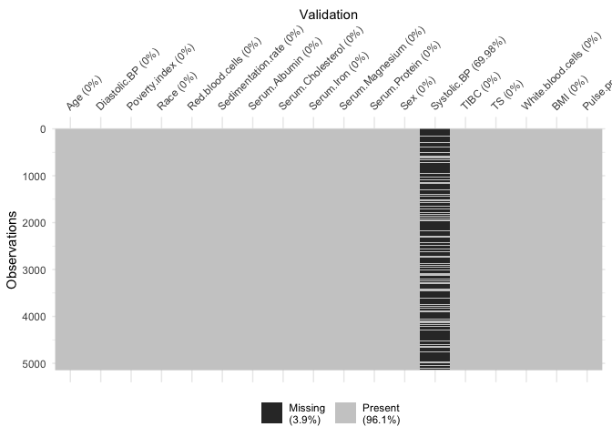

For each feature, represented as a column, values that are present are
shown in gray, and missing values are set in black.

From this plot, we can see that many values are missing for systolic
blood pressure (`Systolic BP`).

## Exercise 1

In the cell below, write a function to compute the fraction of cases
with missing data. This will help us decide how we handle this missing
data in the future.

``` r
# UNQ_C1 (UNIQUE CELL IDENTIFIER, DO NOT EDIT)
fraction_rows_missing <- function(df)
{
  # Return percent of rows with any missing
  #   data in the dataframe. 
  #   
  #   Input:
  #       df (dataframe): a pandas dataframe with potentially missing data
  #   Output:
  #       frac_missing (float): fraction of rows with missing data
  
  ### START CODE HERE (REPLACE 'Pass' with your 'return' code) ###
    return (sum(rowSums(is.na(df)) > 0) / nrow(df))
  ### END CODE HERE ###
}
```

Test your function by running the cell below.

``` r
df_test <- data.frame(a=c(NA, 1, 1, NA),
                      b=c(1, NA, 0, 1))
print("Example dataframe:")
# [1] "Example dataframe:"
df_test
#    a  b
# 1 NA  1
# 2  1 NA
# 3  1  0
# 4 NA  1

print(paste("Computed fraction missing: ", fraction_rows_missing(df_test), ", expected: 0.75", sep = ""))
# [1] "Computed fraction missing: 0.75, expected: 0.75"
print(paste("Fraction of rows missing from X_train: ", round(fraction_rows_missing(X_train), 3), sep = ""))
# [1] "Fraction of rows missing from X_train: 0.7"
print(paste("Fraction of rows missing from X_val: ", round(fraction_rows_missing(X_val), 3), sep = ""))
# [1] "Fraction of rows missing from X_val: 0.7"
print(paste("Fraction of rows missing from X_test: ", round(fraction_rows_missing(X_test), 3), sep = ""))
# [1] "Fraction of rows missing from X_test: 0"
```

We see that our train and validation sets have missing values, but
luckily our test set has complete cases.

As a first pass, we will begin with a **complete case analysis**,
dropping all of the rows with any missing data. Run the following cell
to drop these rows from our train and validation sets.

``` r
train_dropped <- train %>% drop_na() %>% select(-ID)
val_dropped   <- val %>% drop_na() %>% select(-ID)

X_train_dropped <- train_dropped[,1:18]
y_train_dropped <- train_dropped$y
X_val_dropped <- val_dropped[,1:18]
y_val_dropped <- val_dropped$y
```

# 5. Decision Trees

Having just learned about decision trees, you choose to use a decision
tree classifier. Use `rpart` to build a decision tree for the hospital
dataset using the train set.

``` r
dt <- rpart(y ~ ., data=train_dropped, method = 'class')
```

Next we will evaluate our model. We’ll use C-Index for evaluation.

> Remember from lesson 4 of week 1 that the C-Index evaluates the
> ability of a model to differentiate between different classes, by
> quantifying how often, when considering all pairs of patients (A, B),
> the model says that patient A has a higher risk score than patient B
> when, in the observed data, patient A actually died and patient B
> actually lived. In our case, our model is a binary classifier, where
> each risk score is either 1 (the model predicts that the patient will
> die) or 0 (the patient will live).

> More formally, defining permissible pairs of patients as pairs where
> the outcomes are different, concordant pairs as permissible pairs
> where the patient that died had a higher risk score (i.e. our model
> predicted 1 for the patient that died and 0 for the one that lived),
> and ties as permissible pairs where the risk scores were equal
> (i.e. our model predicted 1 for both patients or 0 for both patients),
> the C-Index is equal to:

> $$cindex = \frac{concordant + 0.5\*ties}{permissible}$$

Run the next cell to compute the C-Index on the train and validation set
(we’ve given you an implementation this time).

``` r
y_train_preds <- unlist(predict(dt, train_dropped))[,2]
print(paste("Train C-Index:", cindex(as.numeric(train_dropped$y) - 1, y_train_preds)))
# [1] "Train C-Index: 0.680062675671715"

y_val_preds <- unlist(predict(dt, newdata = val_dropped))[,2]
print(paste("Val C-Index:", cindex(as.numeric(val_dropped$y) - 1, y_val_preds)))
# [1] "Val C-Index: 0.640895747278726"
```

**Note** in R, `rpart` the default values are: `minsplit = 20`,
`maxdepth = 30`. And you **cannot** set maxdepth higher than 30. So here
I cannot reproduce the case when the C-index of training set equal to
1.0

Unfortunately your tree seems to be overfitting: it fits the training
data so closely that it doesn’t generalize well to other samples such as
those from the validation set.

> The training C-index comes out to 1.0 because, when
> initializing`DecisionTreeClasifier`, we have left `max_depth` and
> `min_samples_split` unspecified. The resulting decision tree will
> therefore keep splitting as far as it can, which pretty much
> guarantees a pure fit to the training data.

To handle this, you can change some of the hyperparameters of our tree.

## Exercise 2

Try and find a set of hyperparameters that improves the generalization
to the validation set and recompute the C-index. If you do it right, you
should get C-index above 0.6 for the validation set.

In this exercise, the hint suggested to try different value of
`maxdepth`.

``` r
max_depth <- 3
dt_reg <- rpart(y ~ ., data=train_dropped, method = 'class', maxdepth = max_depth)

y_train_preds <- unlist(predict(dt_reg, train_dropped))[,2]
print(paste("Train C-Index:", cindex(as.numeric(train_dropped$y) - 1, y_train_preds)))
# [1] "Train C-Index: 0.66554769611957"

y_val_preds <- unlist(predict(dt_reg, newdata = val_dropped))[,2]
print(paste("Val C-Index (expected > 0.6):", cindex(as.numeric(val_dropped$y) - 1, y_val_preds)))
# [1] "Val C-Index (expected > 0.6): 0.636946977372509"
```

If you used a low `max_depth` you can print the entire tree. This allows
for easy interpretability. Run the next cell to print the tree splits.

``` r
rpart.plot(dt_reg)
```

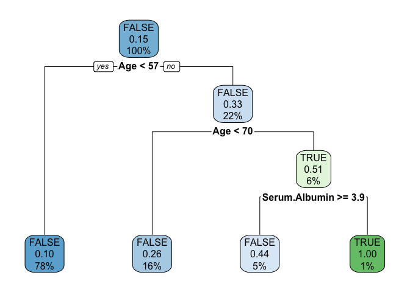

``` r
rpart.plot(dt)
```

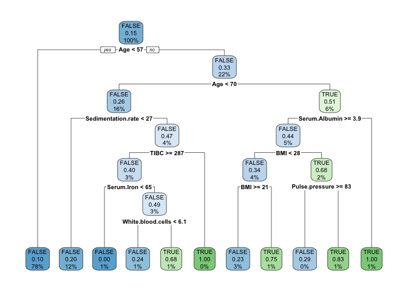

> **Overfitting, underfitting, and the bias-variance tradeoff**

> If you tested several values of `max_depth`, you may have seen that a
> value of `3` gives training and validation C-Indices of about `0.689`
> and `0.630`, and that a `max_depth` of `2` gives better agreement with
> values of about `0.653` and `0.607`. In the latter case, we have
> further reduced overfitting, at the cost of a minor loss in predictive
> performance.

> Contrast this with a `max_depth` value of `1`, which results in
> C-Indices of about `0.597` for the training set and `0.598` for the
> validation set: we have eliminated overfitting but with a much
> stronger degradation of predictive performance.

> Lower predictive performance on the training and validation sets is
> indicative of the model underfitting the data: it neither learns
> enough from the training data nor is able to generalize to unseen data
> (the validation data in our case).

> Finding a model that minimizes and acceptably balances underfitting
> and overfitting (e.g. selecting the model with a `max_depth` of `2`
> over the other values) is a common problem in machine learning that is
> known as the bias-variance tradeoff.

# 6. Random Forests

No matter how you choose hyperparameters, a single decision tree is
prone to overfitting. To solve this problem, you can try **random
forests**, which combine predictions from many different trees to create
a robust classifier.

We will use `randomForest::randomForest` here.

``` r
set.seed(10)
rf <- ranger(y ~ ., data=train_dropped, probability=TRUE) 
```

Now compute and report the C-Index for the random forest on the training
and validation set.

``` r
y_train_preds <- predict(rf,X_train_dropped,type='response')$predictions
y_train_preds <- y_train_preds[,2]
print(paste("Train C-Index:", cindex(as.numeric(y_train_dropped) - 1, y_train_preds)))
# [1] "Train C-Index: 1"

y_val_preds <- predict(rf,X_val_dropped,type='response')$predictions
y_val_preds <- y_val_preds[,2]
print(paste("Val C-Index:", cindex(as.numeric(y_val_dropped) - 1, y_val_preds)))
# [1] "Val C-Index: 0.676694463928507"
```

Training a random forest with the default hyperparameters results in a
model that has better predictive performance than individual decision
trees as in the previous section, but this model is overfitting.

We therefore need to tune (or optimize) the hyperparameters, to find a
model that both has good predictive performance and minimizes
overfitting.

The hyperparameters we choose to adjust will be:

-   `n_estimators`: the number of trees used in the forest. **R:**
    `num.trees`
-   `max_depth`: the maximum depth of each tree. **R:** `max.depth`
-   `min_samples_leaf`: the minimum number (if int) or proportion (if
    float) of samples in a leaf. **R:** `min.node.size`

The approach we implement to tune the hyperparameters is known as a grid
search:

-   We define a set of possible values for each of the target
    hyperparameters.

-   A model is trained and evaluated for every possible combination of
    hyperparameters.

-   The best performing set of hyperparameters is returned.

The cell below implements a hyperparameter grid search, using the
C-Index to evaluate each tested model. **R** Below is a simplied version
of the Python code: it focus on random forest.

``` r
holdout_grid_search <- function(train_hp, val_hp, hyperparams)
{
  # Conduct hyperparameter grid search on hold out validation set. Use holdout validation.
  #   Hyperparameters are input as a dictionary mapping each hyperparameter name to the
  #   range of values they should iterate over. Use the cindex function as your evaluation
  #   function.
  # 
  #   Input:
  #       train_hp (dataframe): dataframe for training set targets
  #       val_hp (dataframe): dataframe for validation set targets
  #       hyperparams (list): hyperparameter list mapping hyperparameter
  #                           names to range of values for grid search
   # 
  #   Output:
  #       best_estimator (): fitted sklearn classifier with best performance on
  #                                            validation set
  #       best_hyperparams (list): hyperparameter dictionary mapping hyperparameter
  #                                names to values in best_estimator
  
  best_estimator <- NULL
  best_hyperparams <- list()
  
  # hold best running score
  best_score <- 0.0
  
  # get all param combinations
  param_combinations <- expand.grid(hyperparams)
  total_param_combinations <- nrow(param_combinations)
  param_names <- names(param_combinations)
  
  # iterate through param combinations
  for (i in 1:total_param_combinations)
  {
    # fill param dict with params
    paramsi <- param_combinations[i,]
    if (length(paramsi) > 1)
    {
      params <- split(t(paramsi), seq(ncol(paramsi)))
      params <- setNames(params, names(paramsi))
    } else
    {
      params <- list(a = paramsi)
      names(params) <- param_names
    }
    
    # create and fit estimator with specified params
    set.seed(10)
    estimator <- do.call(ranger, c(list(formula = formula("y ~ ."),
                                              data    = train_hp,
                                              probability=TRUE),
                                         params)) 

    # get predictions on validation set
    preds <- predict(estimator,val_hp[,1:18],type='response')$predictions
    preds <- preds[,2]
    
    # compute cindex for predictions
    estimator_score <- cindex(as.numeric(val_hp$y) - 1, preds)
    
    pstr <- paste('[', i, '/', total_param_combinations, ']', sep="")
    if (length(paramsi) > 1)
    {
      for (j in 1:length(param_names))
      {
        pstr <- paste( pstr, param_names[j], "=", paramsi[1,j], ",")
      }
    } else
    {
      pstr <- paste( pstr, param_names, "=", paramsi, ",")
    }
    
    print(pstr)
    print(paste('Val C-Index:', estimator_score))
    
    # if new high score, update high score, best estimator
    # and best params 
    if (estimator_score >= best_score) 
    {
      best_score <- estimator_score
      best_estimator <- estimator
      best_hyperparams <- params
    }
  }

  return (list(best_estimator = best_estimator, best_hyperparams = best_hyperparams))
}
```

## Exercise 3

In the cell below, define the values you want to run the hyperparameter
grid search on, and run the cell to find the best-performing set of
hyperparameters.

Your objective is to get a C-Index above `0.6` on both the train and
validation set.

**Hints**

-   `num.trees`: try values greater than 100
-   `max.depth`: try values in the range 1 to 100
-   `min.node.size`: try float values below .5 and/or int values greater
    than 2

**Discussion**

I read some discussions about tuning `max.depth` in random forest. The
hyperparameter sets I got below are not the same as the Python:
`max.depth`.

And I’m wondering why in the python code, they didn’t talk about tuning
‘mtry’.

> `mtry`: the hyperparameter that controls the split-variable
> randomization feature of random forests (default: mtry =
> sqrt(n_feature))

``` r
random_forest_grid_search <- function(train_dropped, val_dropped, hyperparams)
{
  searchRestult <- holdout_grid_search(train_dropped, val_dropped, hyperparams)
  best_rf <- searchRestult$best_estimator
  best_hyperparams <- searchRestult$best_hyperparams
  
  param_names <- names(hyperparams)
  pstr <- "Best hyperparameters:"
  for (j in 1:length(param_names))
  {
    pstr <- paste( pstr, param_names[j], "=", best_hyperparams[[j]], ",")
  }
  print(pstr)
  
  y_train_best <- predict(best_rf,train_dropped[,1:18],type='response')$predictions
  y_train_best <- y_train_best[,2]
  print(paste("Train C-Index:", cindex(as.numeric(train_dropped$y) - 1, y_train_best)))
    
  y_val_best <- predict(best_rf,val_dropped[,1:18],type='response')$predictions
  y_val_best <- y_val_best[,2]
  print(paste("val C-Index:", cindex(as.numeric(val_dropped$y) - 1, y_val_best)))
  
  return(list(best_rf = best_rf, best_hyperparams = best_hyperparams))
}
```

``` r
# Define ranges for the chosen random forest hyperparameters 
hyperparams = list(
  ### START CODE HERE (REPLACE array values with your code) ###
  
  # how many trees should be in the forest (int)
  num.trees = c(100, 150, 200),
  
  # the maximum depth of trees in the forest (int)
  
  max.depth = c(3, 4, 5),
  
  # the minimum number of samples in a leaf as a fraction
  # of the total number of samples in the training set
  # Can be int (in which case that is the minimum number)
  # or float (in which case the minimum is that fraction of the
  # number of training set samples)
  min.node.size = c(3, 4)
  
  ### END CODE HERE ###
)
```

``` r
set.seed(10)
best_res <- random_forest_grid_search(train_dropped, val_dropped, hyperparams)
# [1] "[1/18] num.trees = 100 , max.depth = 3 , min.node.size = 3 ,"
# [1] "Val C-Index: 0.685319408723664"
# [1] "[2/18] num.trees = 150 , max.depth = 3 , min.node.size = 3 ,"
# [1] "Val C-Index: 0.685137557477983"
# [1] "[3/18] num.trees = 200 , max.depth = 3 , min.node.size = 3 ,"
# [1] "Val C-Index: 0.684955706232302"
# [1] "[4/18] num.trees = 100 , max.depth = 4 , min.node.size = 3 ,"
# [1] "Val C-Index: 0.68830696490271"
# [1] "[5/18] num.trees = 150 , max.depth = 4 , min.node.size = 3 ,"
# [1] "Val C-Index: 0.689320136128647"
# [1] "[6/18] num.trees = 200 , max.depth = 4 , min.node.size = 3 ,"
# [1] "Val C-Index: 0.688384901150859"
# [1] "[7/18] num.trees = 100 , max.depth = 5 , min.node.size = 3 ,"
# [1] "Val C-Index: 0.691969968565713"
# [1] "[8/18] num.trees = 150 , max.depth = 5 , min.node.size = 3 ,"
# [1] "Val C-Index: 0.69246356480399"
# [1] "[9/18] num.trees = 200 , max.depth = 5 , min.node.size = 3 ,"
# [1] "Val C-Index: 0.691216584833606"
# [1] "[10/18] num.trees = 100 , max.depth = 3 , min.node.size = 4 ,"
# [1] "Val C-Index: 0.685319408723664"
# [1] "[11/18] num.trees = 150 , max.depth = 3 , min.node.size = 4 ,"
# [1] "Val C-Index: 0.685137557477983"
# [1] "[12/18] num.trees = 200 , max.depth = 3 , min.node.size = 4 ,"
# [1] "Val C-Index: 0.684955706232302"
# [1] "[13/18] num.trees = 100 , max.depth = 4 , min.node.size = 4 ,"
# [1] "Val C-Index: 0.687657496168134"
# [1] "[14/18] num.trees = 150 , max.depth = 4 , min.node.size = 4 ,"
# [1] "Val C-Index: 0.688540773647157"
# [1] "[15/18] num.trees = 200 , max.depth = 4 , min.node.size = 4 ,"
# [1] "Val C-Index: 0.687891304912582"
# [1] "[16/18] num.trees = 100 , max.depth = 5 , min.node.size = 4 ,"
# [1] "Val C-Index: 0.692567479801522"
# [1] "[17/18] num.trees = 150 , max.depth = 5 , min.node.size = 4 ,"
# [1] "Val C-Index: 0.6916842023225"
# [1] "[18/18] num.trees = 200 , max.depth = 5 , min.node.size = 4 ,"
# [1] "Val C-Index: 0.689709817369392"
# [1] "Best hyperparameters: num.trees = 100 , max.depth = 5 , min.node.size = 4 ,"
# [1] "Train C-Index: 0.879430923550334"
# [1] "val C-Index: 0.692567479801522"
best_rf  <- best_res$best_rf
best_hyperparams <- best_res$best_hyperparams
```

Finally, evaluate the model on the test set. This is a crucial step, as
trying out many combinations of hyperparameters and evaluating them on
the validation set could result in a model that ends up overfitting the
validation set. We therefore need to check if the model performs well on
unseen data, which is the role of the test set, which we have held out
until now.

``` r
# UNQ_C3 (UNIQUE CELL IDENTIFIER, DO NOT EDIT)
set.seed(10)
y_test_best <- predict(best_rf,X_test,type='response')$predictions
y_test_best <- y_test_best[,2]
print(paste("Test C-Index:", cindex(as.numeric(y_test) - 1, y_test_best)))
# [1] "Test C-Index: 0.754780647394455"
```

Your C-Index on the test set should be greater than `0.6`.

Below show results with different `mtry` (default num.trees=500;
min.node.size=10):

``` r
hyperparams = list( mtry = 1:18)
```

``` r
set.seed(10)
best_res <- random_forest_grid_search(train_dropped, val_dropped, hyperparams)
# [1] "[1/18] mtry = 1 ,"
# [1] "Val C-Index: 0.675889122697633"
# [1] "[2/18] mtry = 2 ,"
# [1] "Val C-Index: 0.672641779024758"
# [1] "[3/18] mtry = 3 ,"
# [1] "Val C-Index: 0.673628971501312"
# [1] "[4/18] mtry = 4 ,"
# [1] "Val C-Index: 0.676694463928507"
# [1] "[5/18] mtry = 5 ,"
# [1] "Val C-Index: 0.675499441456888"
# [1] "[6/18] mtry = 6 ,"
# [1] "Val C-Index: 0.678720806380381"
# [1] "[7/18] mtry = 7 ,"
# [1] "Val C-Index: 0.678954615124828"
# [1] "[8/18] mtry = 8 ,"
# [1] "Val C-Index: 0.683760683760684"
# [1] "[9/18] mtry = 9 ,"
# [1] "Val C-Index: 0.682331852544618"
# [1] "[10/18] mtry = 10 ,"
# [1] "Val C-Index: 0.684046450003897"
# [1] "[11/18] mtry = 11 ,"
# [1] "Val C-Index: 0.682591640038449"
# [1] "[12/18] mtry = 12 ,"
# [1] "Val C-Index: 0.683968513755748"
# [1] "[13/18] mtry = 13 ,"
# [1] "Val C-Index: 0.682695555035981"
# [1] "[14/18] mtry = 14 ,"
# [1] "Val C-Index: 0.683838620008833"
# [1] "[15/18] mtry = 15 ,"
# [1] "Val C-Index: 0.68986568986569"
# [1] "[16/18] mtry = 16 ,"
# [1] "Val C-Index: 0.683877588132907"
# [1] "[17/18] mtry = 17 ,"
# [1] "Val C-Index: 0.681994128802639"
# [1] "[18/18] mtry = 18 ,"
# [1] "Val C-Index: 0.683916556256982"
# [1] "Best hyperparameters: mtry = 15 ,"
# [1] "Train C-Index: 1"
# [1] "val C-Index: 0.68986568986569"
best_rf  <- best_res$best_rf
best_hyperparams <- best_res$best_hyperparams
```

``` r
set.seed(10)
y_test_best <- predict(best_rf,X_test,type='response')$predictions
y_test_best <- y_test_best[,2]
print(paste("Test C-Index:", cindex(as.numeric(y_test) - 1, y_test_best)))
# [1] "Test C-Index: 0.739301466072645"
```

**Discussion**

It’s quite curious that `ranger` and `randomForest` gave me different
best_hyperparameters from grid search. One possibility is the values of
other hyperparameters. I’ll check it in the future.

# 7. Imputation

You’ve now built and optimized a random forest model on our data.
However, there was still a drop in test C-Index. This might be because
you threw away more than half of the data of our data because of missing
values for systolic blood pressure. Instead, we can try filling in, or
imputing, these values.

First, let’s explore to see if our data is missing at random or not.
Let’s plot histograms of the dropped rows against each of the covariates
(aside from systolic blood pressure) to see if there is a trend. Compare
these to the histograms of the feature in the entire dataset. Try to see
if one of the covariates has a signficantly different distribution in
the two subsets.

``` r
dropped_rows  <- X_train_dropped %>% select(-'Systolic.BP')
full_data     <- X_train %>% select(-'Systolic.BP')

for (i in 1:ncol(dropped_rows))
{
  col <- names(dropped_rows)[i]
  
  df1 <- full_data %>% select(all_of(col)) 
  names(df1) <- "col"
  
  df2 <- dropped_rows %>% select(all_of(col)) 
  names(df2) <- "col"
  
  p <- ggplot(df1, aes(x = col)) +
    geom_histogram(aes(y=..count../sum(..count..)), alpha = 0.5, bins = 20, fill="blue") +
    geom_histogram(data = df2, aes(x = col, y=..count../sum(..count..)), alpha = 0.5, bins = 20, fill="orange") +
    scale_fill_manual(
      values = c("blue", "orange"),
      labels = c('full data', 'without missing data')) +
    xlab(col)+
    ylab("")
  print(p)
}
```

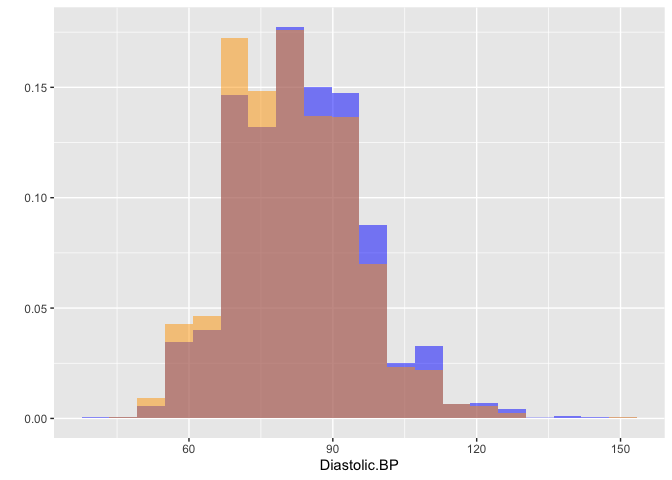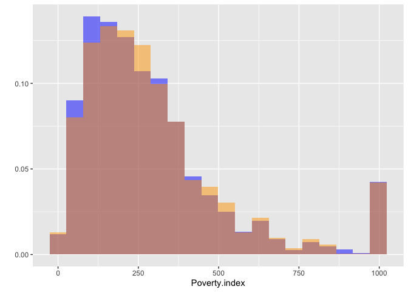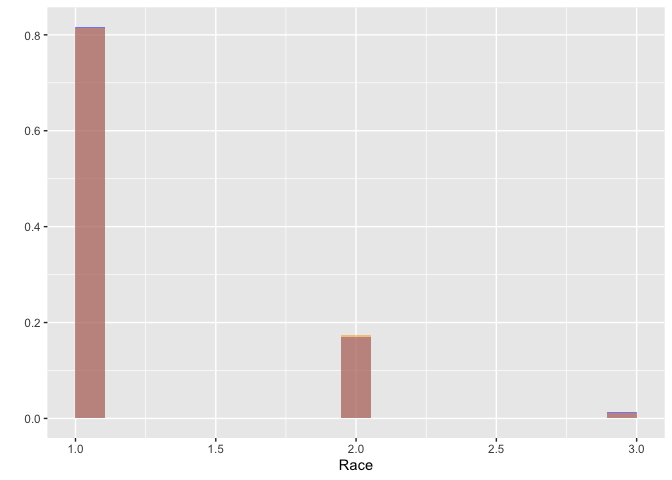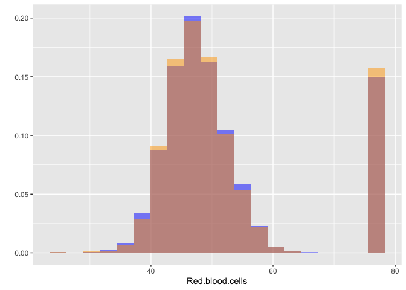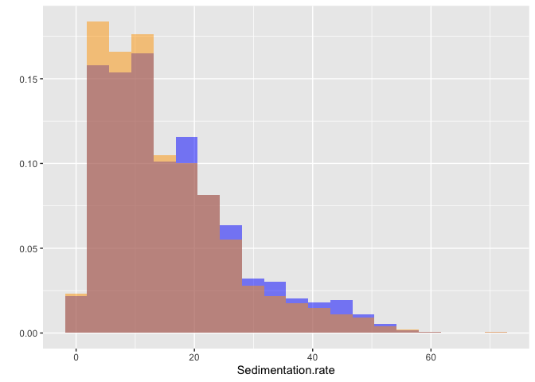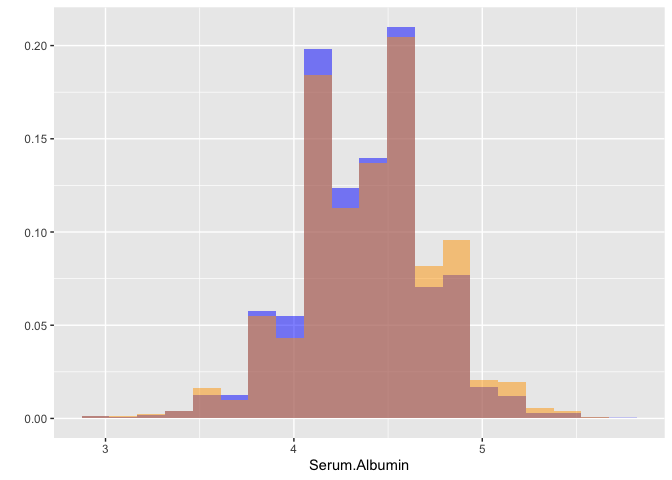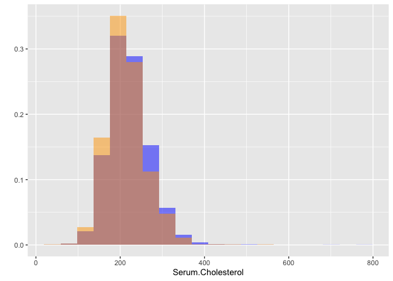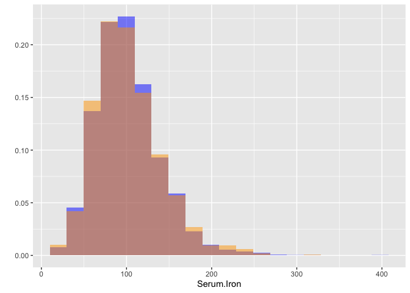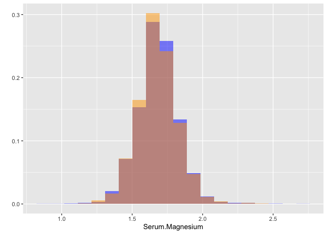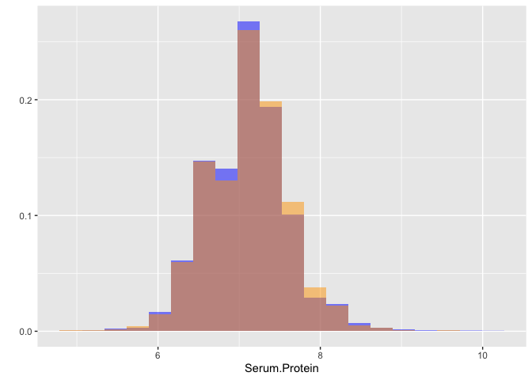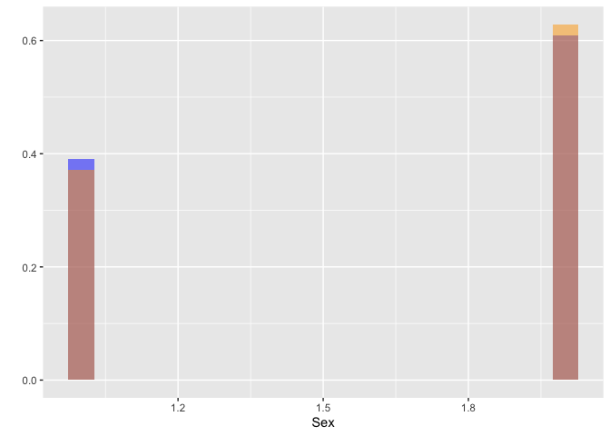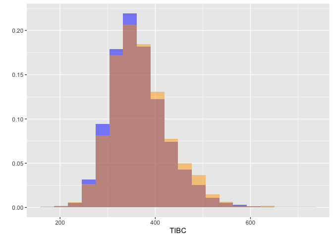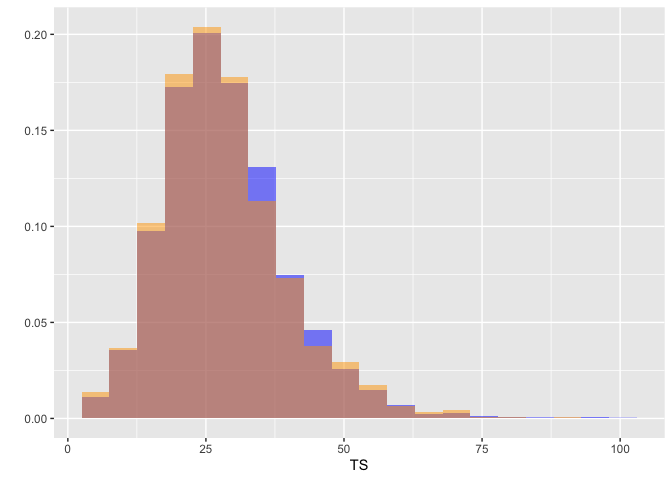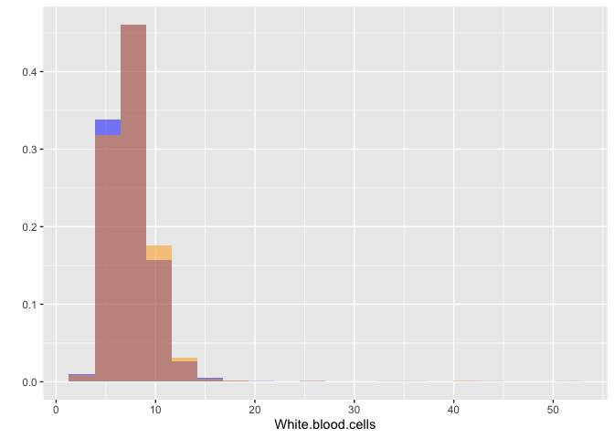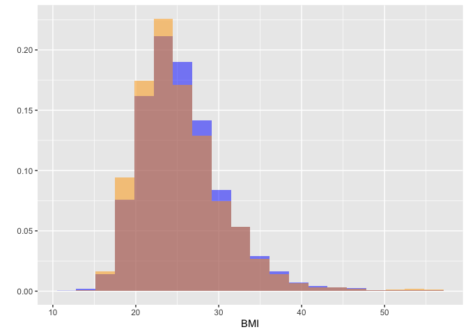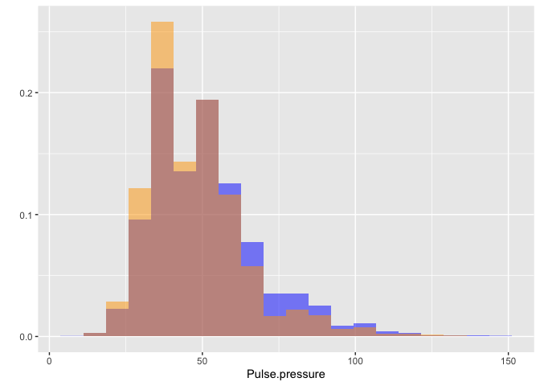

Most of the covariates are distributed similarly whether or not we have
discarded rows with missing data. In other words missingness of the data
is independent of these covariates.

If this had been true across all covariates, then the data would have
been said to be **missing completely at random (MCAR)**.

But when considering the age covariate, we see that much more data tends
to be missing for patients over 65. The reason could be that blood
pressure was measured less frequently for old people to avoid placing
additional burden on them.

As missingness is related to one or more covariates, the missing data is
said to be **missing at random (MAR)**.

Based on the information we have, there is however no reason to believe
that the values of the missing data — or specifically the values of the
missing systolic blood pressures — are related to the age of the
patients. If this was the case, then this data would be said to be
**missing not at random (MNAR)**.

# 8. Error Analysis

## Exercise 4

Using the information from the plots above, try to find a subgroup of
the test data on which the model performs poorly. You should be able to
easily find a subgroup of at least 250 cases on which the model has a
C-Index of less than 0.69.

**Hints**

-   Define a mask using a feature and a threshold, e.g. patients with a
    BMI below 20: `mask = X_test['BMI'] < 20`.
-   Try to find a subgroup for which the model had little data.

``` r
# UNQ_C4 (UNIQUE CELL IDENTIFIER, DO NOT EDIT)
bad_subset <- function(forest, X_test, y_test, age_cut = 40)
{
  # define mask to select large subset with poor performance
  # currently mask defines the entire set
  
  ### START CODE HERE (REPLACE the code after 'mask =' with your code) ###
  mask <- (X_test$Age < age_cut)
  ### END CODE HERE ###
  
  X_subgroup <- X_test[mask,]
  y_subgroup <- y_test[mask]
  subgroup_size <- nrow(X_subgroup)
  
  y_subgroup_preds <- predict(forest, X_subgroup,type='response')$predictions
  y_subgroup_preds <- y_subgroup_preds[,2]
  performance <- cindex(as.numeric(y_subgroup) - 1, y_subgroup_preds)

  
  return(list(performance = performance, subgroup_size = subgroup_size))
}
```

**Test your work**

``` r
result <- bad_subset(best_rf, X_test, y_test)
print("Subgroup size should greater than 250, performance should be less than 0.69")
# [1] "Subgroup size should greater than 250, performance should be less than 0.69"
print(paste("Subgroup size: ", result$subgroup_size,", C-Index: ", result$performance, sep = ""))
# [1] "Subgroup size: 600, C-Index: 0.621323529411765"
```

**Expected Output**

Note, your actual output will vary depending on the hyper-parameters
that you chose and the mask that you chose.

-   Make sure that the c-index is less than 0.69
    -   Subgroup size: 586, C-Index: 0.6275

**Bonus:**

-   See if you can get a c-index as low as 0.53
    -   Subgroup size: 251, C-Index: 0.5331

``` r
result <- bad_subset(best_rf, X_test, y_test, 30)
print(paste("Subgroup size: ", result$subgroup_size,", C-Index: ", result$performance, sep = ""))
# [1] "Subgroup size: 244, C-Index: 0.579450418160096"
```

# 9. Imputation Approaches

Seeing that our data is not missing completely at random, we can handle
the missing values by replacing them with substituted values based on
the other values that we have. This is known as imputation.

The first imputation strategy that we will use is **mean substitution**:
we will replace the missing values for each feature with the mean of the
available values. In the next cell, use the SimpleImputer from sklearn
to use mean imputation for the missing values.

``` r
# Impute values using the mean
train_mean_imputed <- train %>% select(-ID)
for(i in 1:(ncol(train_mean_imputed)-1)){
  train_mean_imputed[is.na(train_mean_imputed[,i]), i] <- mean(train_mean_imputed[,i], na.rm = TRUE)
}

val_mean_imputed <- val %>% select(-ID)
for(i in 1:(ncol(val_mean_imputed)-1)){
  val_mean_imputed[is.na(val_mean_imputed[,i]), i] <- mean(train[,i], na.rm = TRUE) # Note here use mean from X_train
}
```

## Exercise 5

Now perform a hyperparameter grid search to find the best-performing
random forest model, and report results on the test set.

Define the parameter ranges for the hyperparameter search in the next
cell, and run the cell.

**Target performance**

Make your test c-index at least 0.74 or higher

**Hints**

-   `num.trees`: try values greater than 100
-   `max.depth`: try values in the range 1 to 100
-   `min.node.size`: try float values below .5 and/or int values greater
    than 2

``` r
# Define ranges for the random forest hyperparameter search 
hyperparams = list(
  ### START CODE HERE (REPLACE array values with your code) ###
  
  # how many trees should be in the forest (int)
  num.trees = c(100, 150, 200),
  
  # the maximum depth of trees in the forest (int)
  
  max.depth = c(3, 4, 5),
  
  # the minimum number of samples in a leaf as a fraction
  # of the total number of samples in the training set
  # Can be int (in which case that is the minimum number)
  # or float (in which case the minimum is that fraction of the
  # number of training set samples)
  min.node.size = c(3, 4)
  
  ### END CODE HERE ###
)
```

``` r
# UNQ_C5 (UNIQUE CELL IDENTIFIER, DO NOT EDIT)
set.seed(10)
best_res <- random_forest_grid_search(train_mean_imputed, val_mean_imputed, hyperparams)
# [1] "[1/18] num.trees = 100 , max.depth = 3 , min.node.size = 3 ,"
# [1] "Val C-Index: 0.749760608376774"
# [1] "[2/18] num.trees = 150 , max.depth = 3 , min.node.size = 3 ,"
# [1] "Val C-Index: 0.749770269922106"
# [1] "[3/18] num.trees = 200 , max.depth = 3 , min.node.size = 3 ,"
# [1] "Val C-Index: 0.75040685840898"
# [1] "[4/18] num.trees = 100 , max.depth = 4 , min.node.size = 3 ,"
# [1] "Val C-Index: 0.755224749014522"
# [1] "[5/18] num.trees = 150 , max.depth = 4 , min.node.size = 3 ,"
# [1] "Val C-Index: 0.755251586640445"
# [1] "[6/18] num.trees = 200 , max.depth = 4 , min.node.size = 3 ,"
# [1] "Val C-Index: 0.755073384804322"
# [1] "[7/18] num.trees = 100 , max.depth = 5 , min.node.size = 3 ,"
# [1] "Val C-Index: 0.757066883657818"
# [1] "[8/18] num.trees = 150 , max.depth = 5 , min.node.size = 3 ,"
# [1] "Val C-Index: 0.756092141084326"
# [1] "[9/18] num.trees = 200 , max.depth = 5 , min.node.size = 3 ,"
# [1] "Val C-Index: 0.75620807962831"
# [1] "[10/18] num.trees = 100 , max.depth = 3 , min.node.size = 4 ,"
# [1] "Val C-Index: 0.749760608376774"
# [1] "[11/18] num.trees = 150 , max.depth = 3 , min.node.size = 4 ,"
# [1] "Val C-Index: 0.749770269922106"
# [1] "[12/18] num.trees = 200 , max.depth = 3 , min.node.size = 4 ,"
# [1] "Val C-Index: 0.75040685840898"
# [1] "[13/18] num.trees = 100 , max.depth = 4 , min.node.size = 4 ,"
# [1] "Val C-Index: 0.755383627759981"
# [1] "[14/18] num.trees = 150 , max.depth = 4 , min.node.size = 4 ,"
# [1] "Val C-Index: 0.755395436315387"
# [1] "[15/18] num.trees = 200 , max.depth = 4 , min.node.size = 4 ,"
# [1] "Val C-Index: 0.755161412217346"
# [1] "[16/18] num.trees = 100 , max.depth = 5 , min.node.size = 4 ,"
# [1] "Val C-Index: 0.757260114564458"
# [1] "[17/18] num.trees = 150 , max.depth = 5 , min.node.size = 4 ,"
# [1] "Val C-Index: 0.756298254051408"
# [1] "[18/18] num.trees = 200 , max.depth = 5 , min.node.size = 4 ,"
# [1] "Val C-Index: 0.75624243178949"
# [1] "Best hyperparameters: num.trees = 100 , max.depth = 5 , min.node.size = 4 ,"
# [1] "Train C-Index: 0.816214953479286"
# [1] "val C-Index: 0.757260114564458"
rf_mean_imputed  <- best_res$best_rf
best_hyperparams <- best_res$best_hyperparams

set.seed(10)
y_test_best <- predict(rf_mean_imputed,X_test,type='response')$predictions
y_test_best <- y_test_best[,2]
print(paste("Test C-Index:", cindex(as.numeric(y_test) - 1, y_test_best)))
# [1] "Test C-Index: 0.765883942429013"
```

**Expected output**

Note, your actual c-index values will vary depending on the
hyper-parameters that you choose.

-   Try to get a good Test c-index, similar these numbers below:

Performance for best hyperparameters:

-   Train C-Index: 0.8109
-   Val C-Index: 0.7495
-   Test C-Index: 0.7805

Next, we will apply another imputation strategy, known as **multivariate
feature imputation**.

With this strategy, for each feature that is missing values, a
regression model is trained to predict observed values based on all of
the other features, and the missing values are inferred using this
model. As a single iteration across all features may not be enough to
impute all missing values, several iterations may be performed, hence
the name of the class IterativeImputer.

``` r
fit <- lm(Systolic.BP ~ ., data = X_train)
pred <- predict(fit, X_train)
X_train_imputed <- X_train
sbp <- X_train_imputed$Systolic.BP
sbp[is.na(sbp)] <- pred[is.na(sbp)]
X_train_imputed <- X_train_imputed %>% mutate(Systolic.BP = sbp)

pred <- predict(fit, newdata = X_val)
X_val_imputed <- X_val
sbp <- X_val_imputed$Systolic.BP
sbp[is.na(sbp)] <- pred[is.na(sbp)]
X_val_imputed <- X_val_imputed %>% mutate(Systolic.BP = sbp)
```

## Exercise 6

Perform a hyperparameter grid search to find the best-performing random
forest model, and report results on the test set. Define the parameter
ranges for the hyperparameter search in the next cell, and run the cell.

**Target performance**

Make your test c-index at least 0.74 or higher

**Hints**

-   `num.trees`: try values greater than 100
-   `max.depth`: try values in the range 1 to 100
-   `min.node.size`: try float values below .5 and/or int values greater
    than 2

``` r
# Define ranges for the random forest hyperparameter search 
hyperparams = list(
  ### START CODE HERE (REPLACE array values with your code) ###
  
  # how many trees should be in the forest (int)
  num.trees = c(100, 150, 200),
  
  # the maximum depth of trees in the forest (int)
  
  max.depth = c(3, 4, 5),
  
  # the minimum number of samples in a leaf as a fraction
  # of the total number of samples in the training set
  # Can be int (in which case that is the minimum number)
  # or float (in which case the minimum is that fraction of the
  # number of training set samples)
  min.node.size = c(3, 4)
  
  ### END CODE HERE ###
)
```

``` r
# UNQ_C5 (UNIQUE CELL IDENTIFIER, DO NOT EDIT)
train_imputed <- bind_cols(X_train_imputed, y_train)
names(train_imputed)[19] <- "y"
val_imputed <- bind_cols(X_val_imputed, y_val)
names(val_imputed)[19] <- "y"
set.seed(10)
best_res <- random_forest_grid_search(train_imputed, val_imputed, hyperparams)
# [1] "[1/18] num.trees = 100 , max.depth = 3 , min.node.size = 3 ,"
# [1] "Val C-Index: 0.746395170086138"
# [1] "[2/18] num.trees = 150 , max.depth = 3 , min.node.size = 3 ,"
# [1] "Val C-Index: 0.746988818371536"
# [1] "[3/18] num.trees = 200 , max.depth = 3 , min.node.size = 3 ,"
# [1] "Val C-Index: 0.746891129413179"
# [1] "[4/18] num.trees = 100 , max.depth = 4 , min.node.size = 3 ,"
# [1] "Val C-Index: 0.751972028752759"
# [1] "[5/18] num.trees = 150 , max.depth = 4 , min.node.size = 3 ,"
# [1] "Val C-Index: 0.751950558652021"
# [1] "[6/18] num.trees = 200 , max.depth = 4 , min.node.size = 3 ,"
# [1] "Val C-Index: 0.7519441176218"
# [1] "[7/18] num.trees = 100 , max.depth = 5 , min.node.size = 3 ,"
# [1] "Val C-Index: 0.755526403929887"
# [1] "[8/18] num.trees = 150 , max.depth = 5 , min.node.size = 3 ,"
# [1] "Val C-Index: 0.753961233586108"
# [1] "[9/18] num.trees = 200 , max.depth = 5 , min.node.size = 3 ,"
# [1] "Val C-Index: 0.754173787583411"
# [1] "[10/18] num.trees = 100 , max.depth = 3 , min.node.size = 4 ,"
# [1] "Val C-Index: 0.746395170086138"
# [1] "[11/18] num.trees = 150 , max.depth = 3 , min.node.size = 4 ,"
# [1] "Val C-Index: 0.746988818371536"
# [1] "[12/18] num.trees = 200 , max.depth = 3 , min.node.size = 4 ,"
# [1] "Val C-Index: 0.746891129413179"
# [1] "[13/18] num.trees = 100 , max.depth = 4 , min.node.size = 4 ,"
# [1] "Val C-Index: 0.752175994709767"
# [1] "[14/18] num.trees = 150 , max.depth = 4 , min.node.size = 4 ,"
# [1] "Val C-Index: 0.752165259659398"
# [1] "[15/18] num.trees = 200 , max.depth = 4 , min.node.size = 4 ,"
# [1] "Val C-Index: 0.752064350185931"
# [1] "[16/18] num.trees = 100 , max.depth = 5 , min.node.size = 4 ,"
# [1] "Val C-Index: 0.75578404513874"
# [1] "[17/18] num.trees = 150 , max.depth = 5 , min.node.size = 4 ,"
# [1] "Val C-Index: 0.754178081603559"
# [1] "[18/18] num.trees = 200 , max.depth = 5 , min.node.size = 4 ,"
# [1] "Val C-Index: 0.754255373966215"
# [1] "Best hyperparameters: num.trees = 100 , max.depth = 5 , min.node.size = 4 ,"
# [1] "Train C-Index: 0.81357484291305"
# [1] "val C-Index: 0.75578404513874"
rf_imputed  <- best_res$best_rf
best_hyperparams <- best_res$best_hyperparams

set.seed(10)
y_test_best <- predict(rf_imputed,X_test,type='response')$predictions
y_test_best <- y_test_best[,2]
print(paste("Test C-Index:", cindex(as.numeric(y_test) - 1, y_test_best)))
# [1] "Test C-Index: 0.76493261425429"
```

**Expected output**

Note, your actual c-index values will vary depending on the
hyper-parameters that you choose.

-   Try to get a good Test c-index, similar these numbers below:

Performance for best hyperparameters:

-   Train C-Index: 0.8131
-   Val C-Index: 0.7454
-   Test C-Index: 0.7797

# 10. Comparison

For good measure, retest on the subgroup from before to see if your new
models do better.

``` r
result <- bad_subset(best_rf, X_test, y_test)
print(paste("C-Index (no imputation):", result$performance))
# [1] "C-Index (no imputation): 0.621323529411765"

result <- bad_subset(rf_mean_imputed, X_test, y_test)
print(paste("C-Index (mean imputation):", result$performance))
# [1] "C-Index (mean imputation): 0.588826155462185"

result <- bad_subset(rf_imputed, X_test, y_test)
print(paste("C-Index (multivariate feature imputation):", result$performance))
# [1] "C-Index (multivariate feature imputation): 0.588563550420168"
```

We should see that avoiding complete case analysis (i.e. analysis only
on observations for which there is no missing data) allows our model to
generalize a bit better. Remember to examine your missing cases to judge
whether they are missing at random or not!

# 11. Explanations: SHAP

Using a random forest has improved results, but we’ve lost some of the
natural interpretability of trees. In this section we’ll try to explain
the predictions using slightly more sophisticated techniques.

You choose to apply **SHAP (SHapley Additive exPlanations)**, a cutting
edge method that explains predictions made by black-box machine learning
models (i.e. models which are too complex to be understandable by humans
as is).

> Given a prediction made by a machine learning model, SHAP values
> explain the prediction by quantifying the additive importance of each
> feature to the prediction. SHAP values have their roots in cooperative
> game theory, where Shapley values are used to quantify the
> contribution of each player to the game.

> Although it is computationally expensive to compute SHAP values for
> general black-box models, in the case of trees and forests there
> exists a fast polynomial-time algorithm. For more details, see the
> TreeShap paper.

We’ll use the
[`treeshap`](https://www.r-bloggers.com/2021/01/treeshap%E2%80%8A-%E2%80%8Aexplain-tree-based-models-with-shap-values/)
library to do this for our random forest model. Run the next cell to
output the most at risk individuals in the test set according to our
model. **Note** Below figures might be quite different from the Python
version. They are based on my current knowledge of SHAP in R, and I’m
still learning!

``` r
X_test_risk <- X_test 
pred <- predict(rf_imputed, X_test_risk, type='response')$predictions
pred <- pred[,2]

X_test_risk <- X_test_risk %>% 
  mutate(risk = pred) %>% 
  arrange(desc(risk))

head(X_test_risk)
#   Age Diastolic.BP Poverty.index Race Red.blood.cells Sedimentation.rate
# 1  67           80            30    1            77.7                 59
# 2  71          100            92    2            35.1                 36
# 3  67          106            60    2            36.9                 58
# 4  72          104            25    2            41.5                 41
# 5  71           50           149    1            77.7                 29
# 6  69           90            69    2            37.3                 45
#   Serum.Albumin Serum.Cholesterol Serum.Iron Serum.Magnesium Serum.Protein Sex
# 1           3.4             231.0         36            1.40           6.3   1
# 2           3.4             313.1         65            1.44           6.9   1
# 3           2.7             215.0         92            1.27           7.4   2
# 4           3.5             211.0        211            1.13           7.6   1
# 5           4.3             158.0         80            1.52           6.8   1
# 6           2.7             203.0         54            1.28          11.5   2
#   Systolic.BP TIBC   TS White.blood.cells      BMI Pulse.pressure      risk
# 1         170  202 17.8               8.4 17.02947             90 0.6380663
# 2         230  244 26.6               4.4 23.54433            130 0.6097924
# 3         180  239 38.5               8.8 18.43089             74 0.5992997
# 4         180  347 60.8               4.8 26.88153             76 0.5696704
# 5         140  382 20.9              10.6 17.18053             90 0.5632450
# 6         175  299 18.1               5.1 18.87278             85 0.5628666
```

We can use SHAP values to try and understand the model output on
specific individuals using force plots. Run the cell below to see a
force plot on the riskiest individual.

``` r
# We have to start with unifying the model. That operation changes the object of the tree ensemble model into a form understandable for treeshap.
df_test_risk <- cbind(X_test_risk[,1:18],y_test)
names(df_test_risk)[19] <- "y"
# has to do this since treeshap can't work with factors
df_test_risk <- df_test_risk %>% mutate(y = as.numeric(y) - 1) 

# should just use rf_imputed, but somehow ranger.unify has problem with it. So I have belwo model with the same parameters as rf_imputed.
train_imputed <- train_imputed %>% mutate(y = as.numeric(y) - 1)
model <- ranger(y ~ ., data = train_imputed, num.trees = 100, min.node.size = 4)
rf_imputed_unified <- ranger.unify(model, df_test_risk)

# With a unified model on the board, we can now actually compute SHAP values. 
treeshap_res <- treeshap(rf_imputed_unified, df_test_risk)

# SHAP values can be used to explain contribution of features into the prediction for a single observation.
X_test_risk[1,]
plot_contribution(treeshap_res, obs = 1)
```

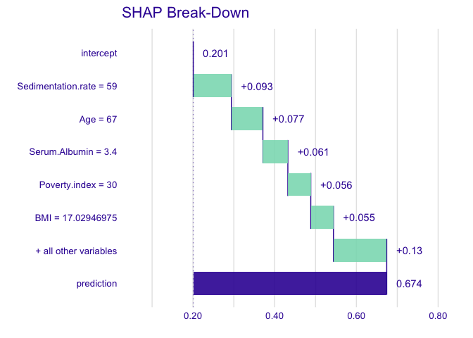

We can also use SHAP values to understand the model output in aggregate.
Run the next cell to initialize the SHAP values (this may take a few
minutes).

``` r
plot_feature_importance(treeshap_res)
```

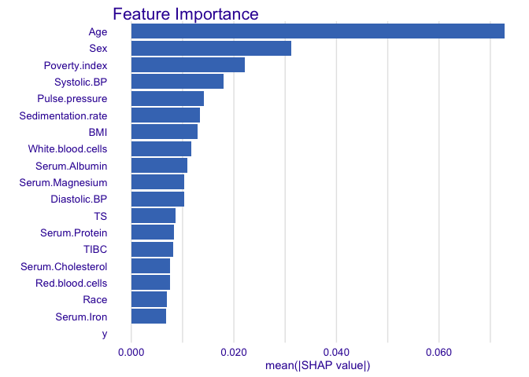

In the Python code: \> You can see how features interact using
dependence plots. These plot the SHAP value for a given feature for each
data point, and color the points in using the value for another feature.
This lets us begin to explain the variation in SHAP value for a single
value of the main feature.

However, in `treeshap`, the dependence_plot is for checking single
variable. We can use below plot to see the impact of being female
(`Sex=2.0`, as oppose to male `Sex = 1.0`), which can not be seen in the
feature importance plot because the current `treeshap` can not work with
factors.

``` r
plot_feature_dependence(treeshap_res, 'Sex')
```

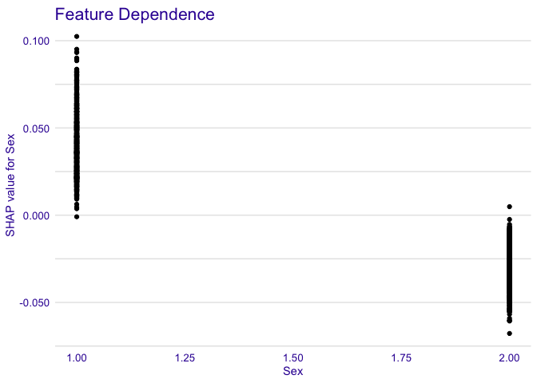

Run the next cell to see the interaction between Age and Sex.

``` r
# treeshap_interactions <- treeshap(rf_imputed_unified, df_test_risk[1:500, ], interactions = T)
# plot_interaction(treeshap_interactions, 'Age', 'Sex')

# To reproduce a similar plot as the Python version
df_Age_Sex <- data.frame(Sex = df_test_risk$Sex,
                         Age = df_test_risk$Age,
                         shapAge = treeshap_res$shaps$Age)

ggplot(df_Age_Sex, aes(Age, shapAge, color = factor(Sex))) +
  geom_point(alpha=0.5)+
  scale_color_manual(values = c("blue", "red"))+
  ylab("SHAP value for Age")+
  geom_hline(yintercept = 0.0, linetype = "dashed")
```

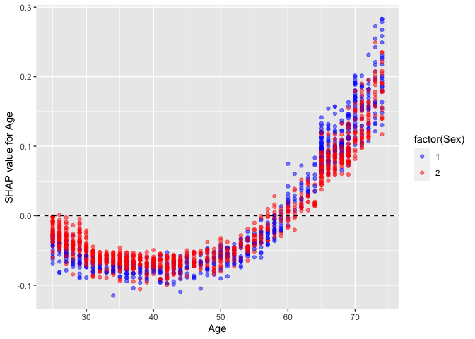

We see that while Age \> 50 is generally bad (positive SHAP value),
being a woman generally reduces the impact of age. This makes sense
since we know that women generally live longer than men.

Let’s now look at poverty index and age.

``` r
df_Age_PI <- data.frame(PI = df_test_risk$Poverty.index,
                         Age = df_test_risk$Age,
                         shapAge = treeshap_res$shaps$Age,
                         shapPI = treeshap_res$shaps$Poverty.index)

ggplot(df_Age_PI, aes(PI, shapPI, color = Age)) +
  geom_point(alpha=0.5)+
  ylab("SHAP value for Poverty index")+
  geom_hline(yintercept = 0.0, linetype = "dashed")
```

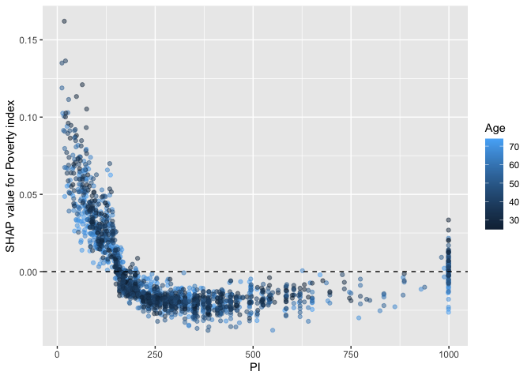

We see that the impact of poverty index drops off quickly, and for
higher income individuals age begins to explain much of variation in the
impact of poverty index.

Try some other pairs and see what other interesting relationships you
can find!

# Congratulations!

You have completed the second assignment in Course 2. Along the way
you’ve learned to fit decision trees, random forests, and deal with
missing data. Now you’re ready to move on to week 3!
