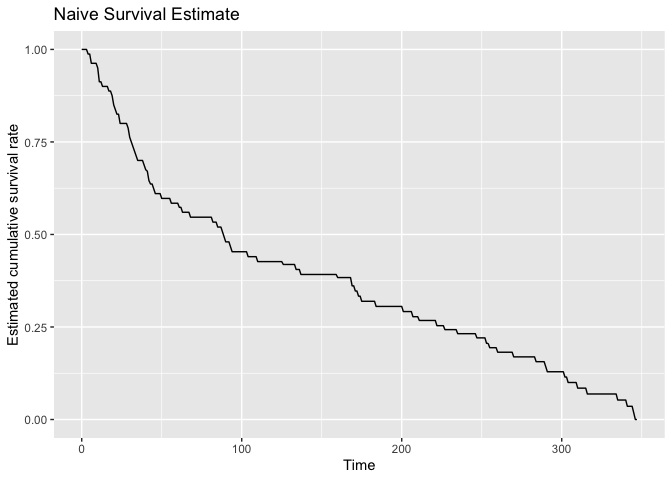

Week 3 Survival Estimates that Vary with Time - using R
================
Juan Li (based on Courera matetials)
06/20/2022

-   <a href="#1-import-packages" id="toc-1-import-packages">1. Import
    Packages</a>
-   <a href="#2-load-the-dataset" id="toc-2-load-the-dataset">2. Load the
    Dataset</a>
-   <a href="#3-censored-data" id="toc-3-censored-data">3. Censored Data</a>
    -   <a href="#exercise-1---frac_censored"
        id="toc-exercise-1---frac_censored">Exercise 1 - frac_censored</a>
-   <a href="#4-survival-estimates" id="toc-4-survival-estimates">4.
    Survival Estimates</a>
    -   <a href="#exercise-2---naive_estimator"
        id="toc-exercise-2---naive_estimator">Exercise 2 - naive_estimator</a>
    -   <a href="#exercise-3---homemadekm"
        id="toc-exercise-3---homemadekm">Exercise 3 - HomemadeKM</a>
-   <a href="#5-subgroup-analysis" id="toc-5-subgroup-analysis">5. Subgroup
    Analysis</a>
    -   <a href="#51-bonus-log-rank-test" id="toc-51-bonus-log-rank-test">5.1
        Bonus: Log-Rank Test</a>
-   <a href="#congratulations" id="toc-congratulations">Congratulations!</a>

Welcome to the third assignment of Course 2. In this assignment, we’ll
use Python to build some of the statistical models we learned this past
week to analyze survival estimates for a dataset of lymphoma patients.
We’ll also evaluate these models and interpret their outputs. Along the
way, you will be learning about the following:

-   Censored Data

-   Kaplan-Meier Estimates

-   Subgroup Analysis

# 1. Import Packages

We’ll first import all the packages that we need for this assignment.

-   lifelines is an open-source library for data analysis. **R:**
    `survival`
-   numpy is the fundamental package for scientific computing in python.
    **R**: `dplyr`
-   pandas is what we’ll use to manipulate our data. **R:** `dplyr`
-   matplotlib is a plotting library. **R:** `ggplot2`

``` r
library(survival)
library(survminer)
library(dplyr)
library(ggplot2)

source('../util.R', echo=TRUE)
# 
# > load_data <- function() {
# +     df <- read.csv("../lymphoma.csv", header = T)
# +     names(df)[3] <- "Event"
# +     return(df)
# + }
```

# 2. Load the Dataset

Run the next cell to load the lymphoma data set.

``` r
data <- load_data()
```

As always, you first look over your data.

``` r
dim(data)
# [1] 80  3
head(data)
#   Stage.group Time Event
# 1           1    6     1
# 2           1   19     1
# 3           1   32     1
# 4           1   42     1
# 5           1   42     1
# 6           1   43     0
```

The column `Time` states how long the patient lived before they died or
were censored.

The column `Event` says whether a death was observed or not. `Event` is
1 if the event is observed (i.e. the patient died) and 0 if data was
censored.

Censorship here means that the observation has ended without any
observed event. For example, let a patient be in a hospital for 100 days
at most. If a patient dies after only 44 days, their event will be
recorded as `Time` = 44 and `Event` = 1. If a patient walks out after
100 days and dies 3 days later (103 days total), this event is not
observed in our process and the corresponding row has `Time` = 100 and
`Event` = 0. If a patient survives for 25 years after being admitted,
their data for are still `Time` = 100 and `Event` = 0.

# 3. Censored Data

We can plot a histogram of the survival times to see in general how long
cases survived before censorship or events.

``` r
ggplot(data, aes(Time)) +
  geom_histogram(bins = 10)+
  xlab("Observation time before death or censorship (days)")+
  ylab("Frequency (number of patients)")
```


## Exercise 1 - frac_censored

In the next cell, write a function to compute the fraction ( ∈\[0,1\] )
of observations which were censored.

**Hints**

-   Summing up the `Event` column will give you the number of
    observations where censorship has NOT occurred.

``` r
# UNQ_C1 (UNIQUE CELL IDENTIFIER, DO NOT EDIT)
frac_censored <- function(df) {
  # Return percent of observations which were censored.
  #   
  #   Args:
  #       df (dataframe): dataframe which contains column 'Event' which is 
  #                       1 if an event occurred (death)
  #                       0 if the event did not occur (censored)
  #   Returns:
  #       frac_censored (float): fraction of cases which were censored. 
  
  result <- 0.0
  
  ### START CODE HERE ###
    
  censored_count <- sum(df$Event == 0)
  result         <- censored_count / nrow(df)
  
  ### END CODE HERE ###
  
  return(result)
}
```

``` r
### do not edit this code cell
frac <- frac_censored(data)
print(paste("Observations which were censored:", frac))
# [1] "Observations which were censored: 0.325"
```

**Expected Output:**

Observations which were censored: 0.325 All tests passed.

Run the next cell to see the distributions of survival times for
censored and uncensored examples.

``` r
df_censored   <- data %>% filter(Event == 0)
df_uncensored <- data %>% filter(Event == 1)

ggplot(df_censored, aes(Time))+
  geom_histogram(bins = 10)+
  labs(title = "Censored",
       x = "Time (days)",
       y = "Frequency")
```


``` r

ggplot(df_uncensored, aes(Time))+
  geom_histogram(bins = 10)+
  labs(title = "Uncensored",
       x = "Time (days)",
       y = "Frequency")
```


# 4. Survival Estimates

We’ll now try to estimate the survival function:

 = P(T > t)")

To illustrate the strengths of Kaplan Meier, we’ll start with a naive
estimator of the above survival function. To estimate this quantity,
we’ll divide the number of people who we know lived past time 𝑡 by the
number of people who were not censored before
.

Formally, let

be the cases, and let

be the time when

was censored or an event happened. Let

if an event was observed for

and 0 otherwise. Then let
,
and let
.
The estimator you will compute will be:

 = \frac{|X_t|}{|M_t|}")

## Exercise 2 - naive_estimator

Write a function to compute this estimate for arbitrary *t* in the cell
below.

``` r
# UNQ_C2 (UNIQUE CELL IDENTIFIER, DO NOT EDIT)
naive_estimator <- function(t, df) {
  # Return naive estimate for S(t), the probability
  #   of surviving past time t. Given by number
  #   of cases who survived past time t divided by the
  #   number of cases who weren't censored before time t.
  #   
  #   Args:
  #       t (int): query time
  #       df (dataframe): survival data. Has a Time column,
  #                       which says how long until that case
  #                       experienced an event or was censored,
  #                       and an Event column, which is 1 if an event
  #                       was observed and 0 otherwise.
  #   Returns:
  #       S_t (float): estimator for survival function evaluated at t.
  
  S_t <- 0.0
  
  ### START CODE HERE ###
    
  X <- sum(df$Time > t)
  
  M <- sum((df$Time > t) | (df$Event == 1)) # CORRECTION
  
  S_t = X / M
  
  ### END CODE HERE ###
  
  return(S_t)
}
```

``` r
### do not edit this code cell
df1  <- data.frame(Time = c(5, 10, 15),
                  Event = c(0, 1, 0))

print(paste("Test Case 1: S(3)", naive_estimator(3, df1)))
# [1] "Test Case 1: S(3) 1"
print(paste("Test Case 2: S(12)", naive_estimator(12, df1)))
# [1] "Test Case 2: S(12) 0.5"
print(paste("Test Case 3: S(20)", naive_estimator(20, df1)))
# [1] "Test Case 3: S(20) 0"

df2  <- data.frame(Time = c(5, 5, 10),
                  Event = c(0, 1, 0))

print(paste("Test Case 4: S(5)", naive_estimator(5, df2)))
# [1] "Test Case 4: S(5) 0.5"
```

**Expected Output:**

Test Case 1: S(3) Output: 1.0

Test Case 2: S(12) Output: 0.5

Test Case 3: S(20) Output: 0.0

Test case 4: S(5) Output: 0.5

All tests passed.

In the next cell, we will plot the naive estimator using the real data
up to the maximum time in the dataset.

``` r
max_time <- max(data$Time, na.rm = TRUE)
x <- 0:(max_time+1)
y <- rep(0, length(x))

for (i in 1:length(x))
{
  y[i] <- naive_estimator(x[i], data)
}

ggplot(data.frame(x = x, y = y), aes(x, y))+
  geom_path()+
  labs(title = "Naive Survival Estimate",
       x = "Time",
       y = "Estimated cumulative survival rate")
```



## Exercise 3 - HomemadeKM

Next let’s compare this with the Kaplan Meier estimate. In the cell
below, write a function that computes the Kaplan Meier estimate of
")
at every distinct time in the dataset.

Recall the Kaplan-Meier estimate:

 = \prod_{t_i <= t}(1-\frac{d_i}{n_i})")

where

are the events observed in the dataset,

is the number of deaths at time

and

is the number of people who we know have survived up to time
.

``` r
# UNQ_C3 (UNIQUE CELL IDENTIFIER, DO NOT EDIT)
HomemadeKM <- function(df) {
  #   Return KM estimate evaluated at every distinct
  #   time (event or censored) recorded in the dataset.
  #   Event times and probabilities should begin with
  #   time 0 and probability 1.
  #   
  #   Example:
  #   
  #   input: 
  #   
  #        Time  Censor
  #   0     5       0
  #   1    10       1
  #   2    15       0
  #   
  #   correct output: 
  #   
  #   event_times: [0, 5, 10, 15]
  #   S: [1.0, 1.0, 0.5, 0.5]
  #   
  #   Args:
  #       df (dataframe): dataframe which has columns for Time
  #                         and Event, defined as usual.
  #                         
  #   Returns:
  #       event_times (list of ints): array of unique event times
  #                                     (begins with 0).
  #       S (list of floats): array of survival probabilites, so that
  #                           S[i] = P(T > event_times[i]). This 
  #                           begins with 1.0 (since no one dies at time
  #                           0).
  
  # individuals are considered to have survival probability 1
  # at time 0
  event_times = c(0)
  p = 1.0
  S = c(p)
  
  ### START CODE HERE ###
    
  # get collection of unique observed event times
  observed_event_times <- unique(df$Time) # CORRECTION
  
  # sort event times
  observed_event_times <- sort(observed_event_times)
  
  # iterate through event times
  for (i in 1:length(observed_event_times))
  {
    t <- observed_event_times[i]
    # compute n_t, number of people who survive to time t
    n_t <- nrow(df %>% filter(Time >= t))
    
    # compute d_t, number of people who die at time t
    d_t = nrow(df %>% filter(Event == 1 & Time == t))
    
    # update P
    p = p * (1 - d_t / n_t)
    
    # update S and event_times
    event_times <- c(event_times, t)
    S           <- c(S, p)
  }
  
  ### END CODE HERE ###
  
  return(list(event_times = event_times, S = S))
}
```

``` r
### do not edit this code cell
df1  <- data.frame(Time = c(5, 10, 15),
                  Event = c(0, 1, 0))
res1 <- HomemadeKM(df1)
print(paste("Test Case 1 Event times: ", list(res1$event_times), ", Survival Probabilities: ", list(res1$S), sep = ""))
# [1] "Test Case 1 Event times: c(0, 5, 10, 15), Survival Probabilities: c(1, 1, 0.5, 0.5)"

df2  <- data.frame(Time = c(2, 15, 12, 10, 20),
                  Event = c(0, 0, 1, 1, 1))
res2 <- HomemadeKM(df2)
print(paste("Test Case 2 Event times: ", list(res2$event_times), ", Survival Probabilities: ", list(res2$S), sep = ""))
# [1] "Test Case 2 Event times: c(0, 2, 10, 12, 15, 20), Survival Probabilities: c(1, 1, 0.75, 0.5, 0.5, 0)"
```

**Expected Output:**

Test Case 1 Event times: \[0, 5, 10, 15\], Survival Probabilities:
\[1.0, 1.0, 0.5, 0.5\] Test Case 2 Event times: \[0, 2, 10, 12, 15,
20\], Survival Probabilities: \[1.0, 1.0, 0.75, 0.5, 0.5, 0.0\]

All tests passed.

Now let’s plot the two against each other on the data to see the
difference.

``` r
max_time <- max(data$Time, na.rm = TRUE)
x <- 0:(max_time+1)
y <- rep(0, length(x))

for (i in 1:length(x))
{
  y[i] <- naive_estimator(x[i], data)
}

df_plt <- data.frame(x = x, 
                     y = y,
                     method = "Naive")

res <- HomemadeKM(data)
df_plt2 <- data.frame(x = res$event_times,
                      y = res$S,
                      method = "Kaplan-Meier")

df_plt <- bind_rows(df_plt, df_plt2)

ggplot(df_plt, aes(x, y, color = method))+
  geom_path()+
  labs(x = "Time",
       y = "Survival probability estimate")
```


**Question**

What differences do you observe between the naive estimator and
Kaplan-Meier estimator? Do any of our earlier explorations of the
dataset help to explain these differences?

# 5. Subgroup Analysis

We see that along with Time and Censor, we have a column called
`Stage_group`. - A value of 1 in this column denotes a patient with
stage III cancer - A value of 2 denotes stage IV.

We want to compare the survival functions of these two groups.

This time we’ll use the `KaplanMeierFitter` class from `lifelines`. Run
the next cell to fit and plot the Kaplan Meier curves for each group.
**R: ** `survival::survfit`

``` r
surv_object <- Surv(time = data$Time, event = data$Event)
surv_object
#  [1]   6   19   32   42   42   43+  94  126+ 169+ 207  211+ 227+ 253  255+ 270+
# [16] 310+ 316+ 335+ 346+   4    6   10   11   11   11   13   17   20   20   21 
# [31]  22   24   24   29   30   30   31   33   34   35   39   40   41+  43+  45 
# [46]  46   50   56   61+  61+  63   68   82   85   88   89   90   93  104  110 
# [61] 134  137  160+ 169  171  173  175  184  201  222  235+ 247+ 260+ 284+ 290+
# [76] 291+ 302+ 304+ 341+ 345+
```

Fit the Kaplan-Meier curves

``` r
fit <- survfit(surv_object ~ Stage.group, data = data)
summary(fit)
# Call: survfit(formula = surv_object ~ Stage.group, data = data)
# 
#                 Stage.group=1 
#  time n.risk n.event survival std.err lower 95% CI upper 95% CI
#     6     19       1    0.947  0.0512        0.852        1.000
#    19     18       1    0.895  0.0704        0.767        1.000
#    32     17       1    0.842  0.0837        0.693        1.000
#    42     16       2    0.737  0.1010        0.563        0.964
#    94     13       1    0.680  0.1080        0.498        0.928
#   207     10       1    0.612  0.1167        0.421        0.889
#   253      7       1    0.525  0.1287        0.324        0.848
# 
#                 Stage.group=2 
#  time n.risk n.event survival std.err lower 95% CI upper 95% CI
#     4     61       1    0.984  0.0163        0.952        1.000
#     6     60       1    0.967  0.0228        0.924        1.000
#    10     59       1    0.951  0.0277        0.898        1.000
#    11     58       3    0.902  0.0381        0.830        0.980
#    13     55       1    0.885  0.0408        0.809        0.969
#    17     54       1    0.869  0.0432        0.788        0.958
#    20     53       2    0.836  0.0474        0.748        0.934
#    21     51       1    0.820  0.0492        0.729        0.922
#    22     50       1    0.803  0.0509        0.709        0.909
#    24     49       2    0.770  0.0538        0.672        0.884
#    29     47       1    0.754  0.0551        0.653        0.870
#    30     46       2    0.721  0.0574        0.617        0.843
#    31     44       1    0.705  0.0584        0.599        0.829
#    33     43       1    0.689  0.0593        0.582        0.815
#    34     42       1    0.672  0.0601        0.564        0.801
#    35     41       1    0.656  0.0608        0.547        0.786
#    39     40       1    0.639  0.0615        0.530        0.772
#    40     39       1    0.623  0.0621        0.512        0.757
#    45     36       1    0.606  0.0627        0.494        0.742
#    46     35       1    0.588  0.0632        0.477        0.726
#    50     34       1    0.571  0.0637        0.459        0.711
#    56     33       1    0.554  0.0641        0.441        0.695
#    63     30       1    0.535  0.0646        0.423        0.678
#    68     29       1    0.517  0.0649        0.404        0.661
#    82     28       1    0.498  0.0652        0.386        0.644
#    85     27       1    0.480  0.0653        0.368        0.627
#    88     26       1    0.461  0.0654        0.350        0.609
#    89     25       1    0.443  0.0653        0.332        0.591
#    90     24       1    0.425  0.0651        0.314        0.573
#    93     23       1    0.406  0.0649        0.297        0.555
#   104     22       1    0.388  0.0645        0.280        0.537
#   110     21       1    0.369  0.0640        0.263        0.519
#   134     20       1    0.351  0.0634        0.246        0.500
#   137     19       1    0.332  0.0627        0.230        0.481
#   169     17       1    0.313  0.0620        0.212        0.461
#   171     16       1    0.293  0.0611        0.195        0.441
#   173     15       1    0.274  0.0601        0.178        0.421
#   175     14       1    0.254  0.0589        0.161        0.400
#   184     13       1    0.235  0.0575        0.145        0.379
#   201     12       1    0.215  0.0559        0.129        0.358
#   222     11       1    0.195  0.0542        0.114        0.336
```

Plot using `ggsurvplot`

``` r
ggsurvplot(fit, data = data,pval = TRUE)
```


A more detailed plot.

``` r
ggsurvplot(fit, data = data,
           pval = TRUE, conf.int = TRUE,
           risk.table = TRUE, # Add risk table
           risk.table.col = "strata", # Change risk table color by groups
           linetype = "strata", # Change line type by groups
           surv.median.line = "hv" # Specify median survival
           )
```


Let’s compare the survival functions at 90, 180, 270, and 360 days,
*i.e.* the survival value at the closest time point before or at the
time points of interest. **Note:** I don’t find an R function does this,
so I write below simple function.

``` r
# CORRECTION
survival_function_at_times <- function(survfit, times) {
  A <- summary(survfit)
  df <- data.frame(group = A$strata, 
                   time  = A$time, 
                   survival = A$surv)
  groupvec <- levels(df$group)
  
  res <- times
  for (i in 1:length(groupvec))
  {
    dfi <- df %>% filter(group == groupvec[i])
    resi <- rep(0, nrow(times))
    for (j in 1:nrow(times))
    {
      resi[j] <- dfi$survival[max(which(dfi$time <= times$time[j]))]
    }
    res <- bind_cols(res, resi)
  }
  
  names(res)[2:ncol(res)] <-groupvec
  
  return(res)
}
```

``` r
survivals <- data.frame(time = c(90, 180, 270, 360))
res <- survival_function_at_times(fit, survivals)
res
#   time Stage.group=1 Stage.group=2
# 1   90     0.7368421     0.4245294
# 2  180     0.6801619     0.2540662
# 3  270     0.5246964     0.1954356
# 4  360     0.5246964     0.1954356
```

This makes clear the difference in survival between the Stage III and IV
cancer groups in the dataset.

## 5.1 Bonus: Log-Rank Test

To say whether there is a statistical difference between the survival
curves we can run the log-rank test. This test tells us the probability
that we could observe this data if the two curves were the same. The
derivation of the log-rank test is somewhat complicated, but luckily
lifelines has a simple function to compute it.

Run the next cell to compute a p-value using
`lifelines.statistics.logrank_test` **R::survival::surv_diff**.

``` r
surv_diff <- survdiff(Surv(Time, Event) ~ Stage.group, data = data)
surv_diff
# Call:
# survdiff(formula = Surv(Time, Event) ~ Stage.group, data = data)
# 
#                N Observed Expected (O-E)^2/E (O-E)^2/V
# Stage.group=1 19        8     16.7      4.52      6.71
# Stage.group=2 61       46     37.3      2.02      6.71
# 
#  Chisq= 6.7  on 1 degrees of freedom, p= 0.01
```

If everything is correct, you should see a p value of less than 0.05,
which indicates that the difference in the curves is indeed
statistically significant.

# Congratulations!

You’ve completed the third assignment of Course 2. You’ve learned about
the Kaplan Meier estimator, a fundamental non-parametric estimator in
survival analysis. Next week we’ll learn how to take into account
patient covariates in our survival estimates!
