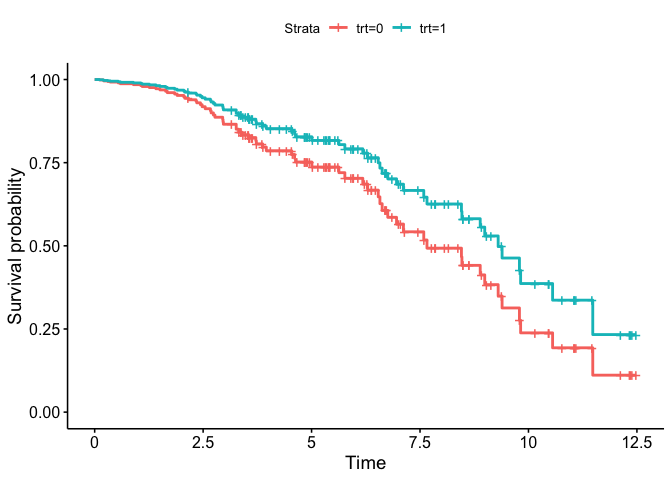
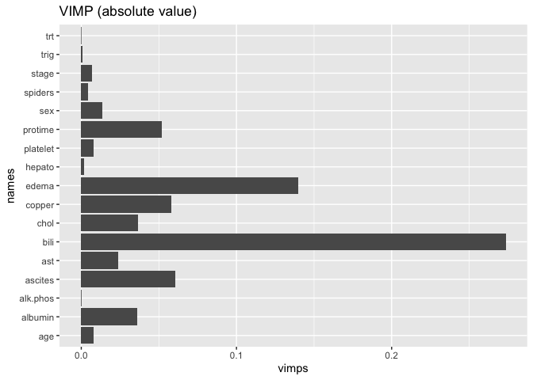

Week 4 Cox Proportional Hazards and Random Survival Forests - using R
================
Juan Li (based on Courera matetials)
06/21/2022

-   <a href="#1-import-packages" id="toc-1-import-packages">1. Import
    Packages</a>
-   <a href="#2-load-the-dataset" id="toc-2-load-the-dataset">2. Load the
    Dataset</a>
-   <a href="#3-explore-the-dataset" id="toc-3-explore-the-dataset">3.
    Explore the Dataset</a>
-   <a href="#4-cox-proportional-hazards"
    id="toc-4-cox-proportional-hazards">4. Cox Proportional Hazards</a>
    -   <a href="#exercise-1---to_one_hot"
        id="toc-exercise-1---to_one_hot">Exercise 1 - to_one_hot</a>
    -   <a href="#look-for-new-features" id="toc-look-for-new-features">Look for
        new features</a>
-   <a href="#5-fitting-and-interpreting-a-cox-model"
    id="toc-5-fitting-and-interpreting-a-cox-model">5. Fitting and
    Interpreting a Cox Model</a>
-   <a href="#6-hazard-ratio" id="toc-6-hazard-ratio">6. Hazard Ratio</a>
    -   <a href="#exercise-2---hazard_ratio"
        id="toc-exercise-2---hazard_ratio">Exercise 2 - hazard_ratio</a>
-   <a href="#7-harrells-c-index" id="toc-7-harrells-c-index">7. Harrell’s
    C-index</a>
    -   <a href="#exercise-3---harrell_c"
        id="toc-exercise-3---harrell_c">Exercise 3 - harrell_c</a>
-   <a href="#random-survival-forests"
    id="toc-random-survival-forests">Random Survival Forests</a>
-   <a href="#permutation-method-for-interpretation"
    id="toc-permutation-method-for-interpretation">Permutation Method for
    Interpretation</a>
    -   <a href="#question" id="toc-question">Question:</a>
-   <a href="#congratulations" id="toc-congratulations">Congratulations!</a>

Welcome to the final assignment in Course 2! In this assignment you’ll
develop risk models using survival data and a combination of linear and
non-linear techniques. We’ll be using a dataset with survival data of
patients with Primary Biliary Cirrhosis (pbc). PBC is a progressive
disease of the liver caused by a buildup of bile within the liver
(cholestasis) that results in damage to the small bile ducts that drain
bile from the liver. Our goal will be to understand the effects of
different factors on the survival times of the patients. Along the way
you’ll learn about the following topics:

-   Cox Proportional Hazards

    -   Data Preprocessing for Cox Models.

-   Random Survival Forests

    -   Permutation Methods for Interpretation.

# 1. Import Packages

We’ll first import all the packages that we need for this assignment.

-   `sklearn` is one of the most popular machine learning libraries.
-   `lifelines` is an open-source library for data analysis. **R:
    survival, survminer**
-   `numpy` is the fundamental package for scientific computing in
    python. **R: dplyr**
-   `pandas` is what we’ll use to manipulate our data. **R: dplyr**
-   `matplotlib` is a plotting library. **R: ggplot2**

``` r
library(survival)
library(survminer)
library(dplyr)
library(ggplot2)
library(caret)
library(splitTools)

source('../util.R', echo=TRUE)
# 
# > load_data <- function() {
# +     library(dplyr)
# +     df <- read.csv("../pbc.csv", header = T)
# +     df <- select(df, -id) %>% filter(status != 1) %> .... [TRUNCATED]
```

# 2. Load the Dataset

Run the next cell to load the lymphoma data set.

``` r
df <- load_data()
```

# 3. Explore the Dataset

In the lecture videos `time` was in months, however in this assignment,
`time` will be converted into years. Also notice that we have assigned a
numeric value to `sex`, where `female = 0` and `male = 1`.

Next, familiarize yourself with the data and the shape of it.

``` r
dim(df)
# [1] 258  19
head(df)
#        time status trt      age sex ascites hepato spiders edema bili chol
# 1  1.095890      1   0 58.76523   0       1      1       1   1.0 14.5  261
# 2 12.328767      0   0 56.44627   0       0      1       1   0.0  1.1  302
# 3  2.772603      1   0 70.07255   1       0      0       0   0.5  1.4  176
# 4  5.273973      1   0 54.74059   0       0      1       1   0.5  1.8  244
# 5  5.019178      0   1 55.53457   0       0      1       0   0.0  1.0  322
# 6  6.756164      1   1 53.05681   0       0      0       0   0.0  0.3  280
#   albumin copper alk.phos    ast trig platelet protime stage
# 1    2.60    156   1718.0 137.95  172      190    12.2     4
# 2    4.14     54   7394.8 113.52   88      221    10.6     3
# 3    3.48    210    516.0  96.10   55      151    12.0     4
# 4    2.54     64   6121.8  60.63   92      183    10.3     4
# 5    4.09     52    824.0  60.45  213      204     9.7     3
# 6    4.00     52   4651.2  28.38  189      373    11.0     3
```

Take a minute to examine particular cases.

``` r
i <- 21
t(df[i,])
#                  21
# time       11.17534
# status      1.00000
# trt         0.00000
# age        44.52019
# sex         1.00000
# ascites     0.00000
# hepato      1.00000
# spiders     0.00000
# edema       0.00000
# bili        2.10000
# chol      456.00000
# albumin     4.00000
# copper    124.00000
# alk.phos 5719.00000
# ast       221.88000
# trig      230.00000
# platelet   70.00000
# protime     9.90000
# stage       2.00000
```

Now, split your dataset into train, validation and test set using
60/20/20 split.

**R: ** Here we use `splitTools::partition` and make sure there are
relatively balanced outcomes `df$status` in the train, validation and
test set. Note the partition can’t be exactly the same as the python
version, below results will be slightly different.

``` r
set.seed(42)

inds <- partition(df$status, p = c(train = 0.6, valid = 0.2, test = 0.2))

df_train <- df[inds$train, ]  # retrieve train data
df_val   <- df[inds$valid,]   # retrieve the validation data
df_test  <- df[inds$test, ]   # retrieve test data

print(paste("Total number of patients:", nrow(df)))
# [1] "Total number of patients: 258"
print(paste("Total number of patients in training set::", nrow(df_train)))
# [1] "Total number of patients in training set:: 155"
print(paste("Total number of patients in validation set::", nrow(df_val)))
# [1] "Total number of patients in validation set:: 51"
print(paste("Total number of patients in testing set::", nrow(df_test)))
# [1] "Total number of patients in testing set:: 52"
```

Before proceeding to modeling, let’s normalize the continuous covariates
to make sure they’re on the same scale. Again, we should normalize the
test data using statistics from the train data.

``` r
continuous_columns <- c('age', 'bili', 'chol', 'albumin', 'copper', 'alk.phos', 'ast', 'trig', 'platelet', 'protime')

mean <- colMeans(df_train[,names(df_train) %in% continuous_columns]) 
std  <- apply(df_train[,names(df_train) %in% continuous_columns], 2, sd)

# standardize the training set
meanMat  <- matrix(rep(mean,nrow(df_train)),nrow=nrow(df_train), byrow = TRUE)
df_train[,names(df_train) %in% continuous_columns] <- t(t(df_train[,names(df_train) %in% continuous_columns] - meanMat) / std)

# standardize the validation set
meanMat  <- matrix(rep(mean,nrow(df_val)),nrow=nrow(df_val), byrow = TRUE)
df_val[,names(df_val) %in% continuous_columns] <- t(t(df_val[,names(df_val) %in% continuous_columns] - meanMat) / std)

# standardize the testing set
meanMat  <- matrix(rep(mean,nrow(df_test)),nrow=nrow(df_test), byrow = TRUE)
df_test[,names(df_test) %in% continuous_columns] <- t(t(df_test[,names(df_test) %in% continuous_columns] - meanMat) / std)
```

Let’s check the summary statistics on our training dataset to make sure
it’s standardized.

``` r
df_check <- df_train[,names(df_train) %in% continuous_columns] 
summary(df_check)
#       age               bili              chol            albumin        
#  Min.   :-2.2729   Min.   :-0.6663   Min.   :-1.0540   Min.   :-3.71260  
#  1st Qu.:-0.7070   1st Qu.:-0.5647   1st Qu.:-0.5059   1st Qu.:-0.53373  
#  Median : 0.0229   Median :-0.4428   Median :-0.2698   Median : 0.03485  
#  Mean   : 0.0000   Mean   : 0.0000   Mean   : 0.0000   Mean   : 0.00000  
#  3rd Qu.: 0.5578   3rd Qu.: 0.1364   3rd Qu.: 0.1102   3rd Qu.: 0.66804  
#  Max.   : 2.8051   Max.   : 4.4549   Max.   : 5.5672   Max.   : 2.23163  
#      copper           alk.phos             ast               trig        
#  Min.   :-1.0307   Min.   :-0.84330   Min.   :-1.5958   Min.   :-1.1584  
#  1st Qu.:-0.6131   1st Qu.:-0.50991   1st Qu.:-0.6639   1st Qu.:-0.5664  
#  Median :-0.3257   Median :-0.32771   Median :-0.2036   Median :-0.2774  
#  Mean   : 0.0000   Mean   : 0.00000   Mean   : 0.0000   Mean   : 0.0000  
#  3rd Qu.: 0.3955   3rd Qu.: 0.04275   3rd Qu.: 0.4456   3rd Qu.: 0.3490  
#  Max.   : 5.2489   Max.   : 4.61450   Max.   : 5.4479   Max.   : 6.4679  
#     platelet           protime       
#  Min.   :-2.00964   Min.   :-1.7596  
#  1st Qu.:-0.65975   1st Qu.:-0.7855  
#  Median :-0.06376   Median :-0.1362  
#  Mean   : 0.00000   Mean   : 0.0000  
#  3rd Qu.: 0.48130   3rd Qu.: 0.4050  
#  Max.   : 3.09449   Max.   : 4.8423
```

# 4. Cox Proportional Hazards

Our goal is to build a risk score using the survival data that we have.
We’ll begin by fitting a Cox Proportional Hazards model to your data.

Recall that the Cox Proportional Hazards model describes the hazard for
an individual

at time

as

 = \lambda_0(t)e^{\theta^TX_i}")

The

term is a baseline hazard and incorporates the risk over time, and the
other term incorporates the risk due to the individual’s covariates.
After fitting the model, we can rank individuals using the
person-dependent risk term
.

Categorical variables cannot be used in a regression model as they are.
In order to use them, conversion to a series of variables is required.

Since our data has a mix of categorical (`stage`) and continuous
(`wblc`) variables, before we proceed further we need to do some data
engineering. To tackle the issue at hand we’ll be using the
`Dummy Coding` technique. In order to use Cox Proportional Hazards, we
will have to turn the categorical data into one hot features so that we
can fit our Cox model. Luckily, Pandas has a built-in function called
`get_dummies` **R: caret::dummyVars** that will make it easier for us to
implement our function. It turns categorical features into multiple
binary features.

## Exercise 1 - to_one_hot

In the cell below, implement the to_one_hot(…) function.

**Hints**

-   Remember to drop the first dummy for each each category to avoid
    convergence issues when fitting the proportional hazards model.
-   Check out the get_dummies() documentation.
-   Use dtype=np.float64.

``` r
# UNQ_C1 (UNIQUE CELL IDENTIFIER, DO NOT EDIT)
to_one_hot <- function(dataframe, columns)
{
  # Convert columns in dataframe to one-hot encoding.
  #   Args:
  #       dataframe (dataframe): pandas dataframe containing covariates
  #       columns (list of strings): list categorical column names to one hot encode
  #   Returns:
  #       one_hot_df (dataframe): dataframe with categorical columns encoded
  #                           as binary variables
  
  ### START CODE HERE (REPLACE INSTANCES OF 'None' with your code) ###
  dataframe[,names(dataframe) %in% columns] <- lapply(dataframe[,names(dataframe) %in% columns], factor)
  formula <- "~"
  for (i in 1:(length(columns)-1)) formula <- paste(formula, columns[i], "+")
  formula <- paste(formula, columns[length(columns)])
  dmy <- dummyVars(formula, data=dataframe, fullRank=T)
  one_hot_df <- data.frame(predict(dmy, newdata = dataframe))
  one_hot_df <- bind_cols(dataframe[,!(names(dataframe) %in% columns)],one_hot_df)

  ### END CODE HERE ###
  return (one_hot_df)
}
```

``` r
# test cell ex1 - do not modify this test cell
to_encode <- c('spiders', 'stage')

one_hot_train <- to_one_hot(df_train, to_encode)
one_hot_val <- to_one_hot(df_val, to_encode)
one_hot_test <- to_one_hot(df_test, to_encode)

names(one_hot_val)
#  [1] "time"      "status"    "trt"       "age"       "sex"       "ascites"  
#  [7] "hepato"    "edema"     "bili"      "chol"      "albumin"   "copper"   
# [13] "alk.phos"  "ast"       "trig"      "platelet"  "protime"   "spiders.1"
# [19] "stage.2"   "stage.3"   "stage.4"
print(paste("There are", ncol(one_hot_val), "columns"))
# [1] "There are 21 columns"
```

**Expected Output:**

One hot val columns:

\[‘time’, ‘status’, ‘trt’, ‘age’, ‘sex’, ‘ascites’, ‘hepato’, ‘edema’,
‘bili’, ‘chol’, ‘albumin’, ‘copper’, ‘alk.phos’, ‘ast’, ‘trig’,
‘platelet’, ‘protime’, ‘spiders_1.0’, ‘stage_2.0’, ‘stage_3.0’,
‘stage_4.0’\]

There are 21 columns

All tests passed.

Now you’ll use the function you coded to transform the training,
validation, and test sets.

``` r
to_encode <- c('edema', 'stage')

one_hot_train <- to_one_hot(df_train, to_encode)
one_hot_val <- to_one_hot(df_val, to_encode)
one_hot_test <- to_one_hot(df_test, to_encode)
```

## Look for new features

Now, let’s take a peek at one of the transformed data sets. Do you
notice any new features?

``` r
dim(one_hot_train)
# [1] 155  22
head(one_hot_train)
#        time status trt        age sex ascites hepato spiders        bili
# 1  1.095890      1   0  0.7890911   0       1      1       1  2.21947257
# 2 12.328767      0   0  0.5514631   0       0      1       1 -0.50373426
# 3  2.772603      1   0  1.9477730   1       0      0       0 -0.44276695
# 5  5.019178      0   1  0.4580391   0       0      1       0 -0.52405670
# 6  6.756164      1   1  0.2041391   0       0      0       0 -0.66631378
# 7  6.575342      1   0 -0.8768298   0       0      0       1 -0.07696304
#         chol    albumin     copper   alk.phos        ast       trig    platelet
# 1 -0.4898645 -2.4203742  0.5636183 -0.1508368  0.2037313  0.6036559 -0.70559289
# 2 -0.3258364  1.5596708 -0.5426269  2.6000139 -0.1975061 -0.5526778 -0.38976859
# 3 -0.8299227 -0.1460628  1.1492776 -0.7332993 -0.4836116 -1.0069517 -1.10292024
# 5 -0.2458227  1.4304485 -0.5643180 -0.5840493 -1.0691260  1.1680569 -0.56296256
# 6 -0.4138515  1.1978485 -0.5643180  1.2705265 -1.5958426  0.8376758  1.15878926
# 7  0.7143417 -1.1798407 -0.2714884  0.1195575  0.3055599 -0.5526778 -0.08413218
#      protime edema.0.5 edema.1 stage.2 stage.3 stage.4
# 1  1.5954763         0       1       0       0       1
# 2 -0.1361566         0       0       0       1       0
# 3  1.3790222         1       0       0       0       1
# 5 -1.1102001         0       0       0       1       0
# 6  0.2967516         0       0       0       1       0
# 7  0.2967516         0       0       1       0       0
```

# 5. Fitting and Interpreting a Cox Model

Run the following cell to fit your Cox Proportional Hazards model using
the `lifelines` package **R: survival, survminer**.

``` r
cph <- coxph(Surv(time, status) ~ ., data = one_hot_train) 
```

You can use cph.print_summary() to view the coefficients associated with
each covariate as well as confidence intervals.

``` r
summary(cph)
# Call:
# coxph(formula = Surv(time, status) ~ ., data = one_hot_train)
# 
#   n= 155, number of events= 67 
# 
#               coef exp(coef) se(coef)      z Pr(>|z|)    
# trt       -0.41143   0.66270  0.30801 -1.336  0.18163    
# age        0.09294   1.09740  0.15124  0.615  0.53884    
# sex        0.30408   1.35538  0.43928  0.692  0.48879    
# ascites    0.36677   1.44306  0.53967  0.680  0.49675    
# hepato    -0.28512   0.75193  0.33121 -0.861  0.38933    
# spiders    0.08461   1.08829  0.36355  0.233  0.81597    
# bili       0.82602   2.28422  0.20598  4.010 6.07e-05 ***
# chol      -0.09809   0.90656  0.15534 -0.631  0.52773    
# albumin   -0.07475   0.92797  0.19457 -0.384  0.70084    
# copper     0.24988   1.28388  0.13289  1.880  0.06005 .  
# alk.phos  -0.12915   0.87884  0.12279 -1.052  0.29288    
# ast        0.42663   1.53208  0.15303  2.788  0.00531 ** 
# trig      -0.40192   0.66903  0.13832 -2.906  0.00366 ** 
# platelet   0.42569   1.53065  0.14429  2.950  0.00317 ** 
# protime    0.13074   1.13967  0.17261  0.757  0.44879    
# edema.0.5  1.15088   3.16097  0.44175  2.605  0.00918 ** 
# edema.1    0.83874   2.31345  0.66290  1.265  0.20578    
# stage.2    0.63906   1.89470  1.13136  0.565  0.57217    
# stage.3    1.18353   3.26587  1.09022  1.086  0.27766    
# stage.4    2.03508   7.65283  1.16047  1.754  0.07949 .  
# ---
# Signif. codes:  0 '***' 0.001 '**' 0.01 '*' 0.05 '.' 0.1 ' ' 1
# 
#           exp(coef) exp(-coef) lower .95 upper .95
# trt          0.6627     1.5090    0.3624    1.2120
# age          1.0974     0.9112    0.8159    1.4760
# sex          1.3554     0.7378    0.5730    3.2061
# ascites      1.4431     0.6930    0.5011    4.1558
# hepato       0.7519     1.3299    0.3929    1.4391
# spiders      1.0883     0.9189    0.5337    2.2192
# bili         2.2842     0.4378    1.5255    3.4203
# chol         0.9066     1.1031    0.6686    1.2292
# albumin      0.9280     1.0776    0.6337    1.3588
# copper       1.2839     0.7789    0.9895    1.6659
# alk.phos     0.8788     1.1379    0.6909    1.1180
# ast          1.5321     0.6527    1.1351    2.0680
# trig         0.6690     1.4947    0.5102    0.8774
# platelet     1.5307     0.6533    1.1536    2.0309
# protime      1.1397     0.8774    0.8126    1.5985
# edema.0.5    3.1610     0.3164    1.3298    7.5134
# edema.1      2.3134     0.4323    0.6310    8.4825
# stage.2      1.8947     0.5278    0.2063   17.4004
# stage.3      3.2659     0.3062    0.3855   27.6691
# stage.4      7.6528     0.1307    0.7871   74.4076
# 
# Concordance= 0.839  (se = 0.023 )
# Likelihood ratio test= 107  on 20 df,   p=7e-14
# Wald test            = 100.4  on 20 df,   p=1e-12
# Score (logrank) test = 166.8  on 20 df,   p=<2e-16
```

**Question:**

-   According to the model, was treatment `trt` beneficial?

-   What was its associated hazard ratio?

    -   Note that the hazard ratio is how much an incremental increase
        in the feature variable changes the hazard.

**Check your answer!**

-   You should see that the treatment (`trt`) was beneficial because it
    has a negative impact on the hazard (the coefficient is negative,
    and exp(coef) is less than 1).

-   The associated hazard ratio is \~0.66, because this is the exp(coef)
    of treatment.

We can compare the predicted survival curves for treatment variables.
Run the next cell to plot survival curves using the
`plot_covariate_groups()` function.

-   The y-axis is th survival rate

-   The x-axis is time

``` r
trt_df <- bind_rows(data.frame(t(colMeans(one_hot_train))),data.frame(t(colMeans(one_hot_train))))
trt_df$trt <- c(0,1)

fit  <- survfit(cph, newdata = trt_df)
ggsurvplot(fit, data = one_hot_train, 
           conf.int = FALSE, legend.labs=c("trt=0", "trt=1"))
# Warning: `gather_()` was deprecated in tidyr 1.2.0.
# ℹ Please use `gather()` instead.
# ℹ The deprecated feature was likely used in the survminer package.
#   Please report the issue at <https://github.com/kassambara/survminer/issues>.
```



Notice how the group without treatment has a lower survival rate at all
times (the x-axis is time) compared to the treatment group.

# 6. Hazard Ratio

Recall from the lecture videos that the Hazard Ratio between two
patients was the likelihood of one patient (e.g smoker) being more at
risk than the other (e.g non-smoker).

}{\lambda_{nonsmoker}(t)} = e^{\theta (X_{smoker}-X_{nonsmoker})^T}")

Where

 = \lambda_0(t)e^{\theta X_{smoker}^T}")

and

 = \lambda_0(t)e^{\theta X_{nonsmoker}^T}")

## Exercise 2 - hazard_ratio

In the cell below, write a function to compute the hazard ratio between
two individuals given the cox model’s coefficients.

``` r
# UNQ_C2 (UNIQUE CELL IDENTIFIER, DO NOT EDIT)
hazard_ratio <- function(case_1, case_2, cox_params)
{
  # Return the hazard ratio of case_1 : case_2 using
  #   the coefficients of the cox model.
  #   
  #   Args:
  #       case_1 (np.array): (1 x d) array of covariates
  #       case_2 (np.array): (1 x d) array of covariates
  #       model (np.array): (1 x d) array of cox model coefficients
  #   Returns:
  #       hazard_ratio (float): hazard ratio of case_1 : case_2
  
  ### START CODE HERE (REPLACE INSTANCES OF 'None' with your code) ###
    
  hr <- exp(cox_params %*% t(case_1)) / exp(cox_params %*% t(case_2))
  
  ### END CODE HERE ###
  
  return (hr)
}
```

Now, evaluate it on the following pair of indivduals: `i = 1` and
`j = 5`. Given your implementation of `hazard_ratio` is correct, you
will only pass the test when `i = 1` and `j = 5`.

``` r
i <- 2
j <- 6

hazard_ratio(one_hot_train[i,-c(1,2)], one_hot_train[j,-c(1,2)], cph$coefficients)
#              2
# [1,] 0.4263011
```

**Question:**

Is case_1 or case_2 at greater risk?

**Check your answer!** Important! The following answer only applies if
you picked i = 1 and j = 5. **R code: the data split is not identical to
the python version, here we are not comparing the same pair** You should
see that `case_1` is at lower risk. The hazard ratio of case 1 / case 2
is smaller than 1, so case 1 had a lower hazard relative to case 2

``` r
i <- 8
case_1 <- one_hot_train[i,-c(1,2)]
j <- 5
case_2 <- one_hot_train[j,-c(1,2)]

print("Case 1")
# [1] "Case 1"
case_1
#    trt      age sex ascites hepato spiders       bili       chol   albumin
# 12   0 1.391718   0       0      0       0 -0.5647016 -0.6098851 0.8618707
#       copper alk.phos        ast       trig  platelet   protime edema.0.5
# 12 0.7479925 3.382607 0.03554994 -0.4425507 0.3641346 0.2967516         0
#    edema.1 stage.2 stage.3 stage.4
# 12       0       0       1       0
print("Case 2")
# [1] "Case 2"
case_2
#   trt       age sex ascites hepato spiders       bili       chol  albumin
# 6   1 0.2041391   0       0      0       0 -0.6663138 -0.4138515 1.197848
#      copper alk.phos       ast      trig platelet   protime edema.0.5 edema.1
# 6 -0.564318 1.270526 -1.595843 0.8376758 1.158789 0.2967516         0       0
#   stage.2 stage.3 stage.4
# 6       0       1       0
print(paste("Hazard Ratio:", hazard_ratio(case_1, case_2, cph$coefficients)))
# [1] "Hazard Ratio: 4.8428302546314"
```

# 7. Harrell’s C-index

To evaluate how good our model is performing, we will write our own
version of the C-index. Similar to the week 1 case, C-index in the
survival context is the probability that, given a randomly selected pair
of individuals, the one who died sooner has a higher risk score.

However, we need to take into account censoring. Imagine a pair of
patients,

and
.

**Scenario 1**

-   
    was censored at time
    

-   
    died at
    

-   

Because of censoring, we can’t say whether

or

should have a higher risk score.

**Scenario 2**

Now imagine that


-   
    was censored at time
    

-   
    died at
    

-   

Now we can definitively say that

should have a higher risk score than
,
since we know for a fact that

lived longer.

Therefore, when we compute our C-index

-   We should only consider pairs where at most one person is censored

-   If they are censored, then their censored time should occur after
    the other person’s time of death.

The metric we get if we use this rule is called **Harrel’s C-index**.

Note that in this case, being censored at time

means that the true death time was some time AFTER time

and not at

.

-   Therefore if
    
    and
    
    was censored:

    -   Then
        
        actually lived longer than
        .

    -   This will effect how you deal with ties in the exercise below!

## Exercise 3 - harrell_c

Fill in the function below to compute Harrel’s C-index.

**Hints**

-   If you get a division by zero error, consider checking how you count
    when a pair is permissible (in the case where one patient is
    censored and the other is not censored).

``` r
# UNQ_C3 (UNIQUE CELL IDENTIFIER, DO NOT EDIT)
harrell_c <- function(y_true, scores, event)
{
  # Compute Harrel C-index given true event/censoring times,
  #   model output, and event indicators.
  #   
  #   Args:
  #       y_true (array): array of true event times
  #       scores (array): model risk scores
  #       event (array): indicator, 1 if event occurred at that index, 0 for censorship
  #   Returns:
  #       result (float): C-index metric
  
  n <- length(y_true)
  
  concordant = 0.0
  permissible = 0.0
  ties = 0.0
    
  result = 0.0
  
  ### START CODE HERE (REPLACE INSTANCES OF 'None' and 'pass' with your code) ###
  
  # use double for loop to go through cases
  for (i in 1:(n-1))
  {
    # set lower bound on j to avoid double counting
    for (j in (i+1):n)
    {
      # check if at most one is censored
      if (event[i] == 1 | event[j] == 1)
      {
        # check if neither are censored
        if (event[i] == 1 & event[j] == 1)
        {
          permissible = permissible + 1.0
          
          # check if scores are tied
          if (scores[i] == scores[j])
          {
            ties = ties + 1.0
          } else if (y_true[i] < y_true[j] & scores[i] > scores[j])# check for concordant
          {
            concordant = concordant + 1.0
          } else if (y_true[i] > y_true[j] & scores[i] < scores[j])
          {
            concordant = concordant + 1.0
          }
        } else if (event[i] != event[j]) # check if one is censored
        {
          # get censored index
          censored = j
          uncensored = i
          
          if (event[i] == 0)
          {
            censored = i
            uncensored = j
          }
          
          # check if permissible
          # Note: in this case, we are assuming that censored at a time
          # means that you did NOT die at that time. That is, if you
          # live until time 30 and have event = 0, then you lived THROUGH
          # time 30.
          if (y_true[uncensored] <= y_true[censored])
          {
            permissible = permissible + 1.0
            
            # check if scores are tied
            if (scores[uncensored] == scores[censored])
            {
              # update ties 
              ties = ties + 1.0
            }
            
            # check if scores are concordant 
            if (scores[uncensored] > scores[censored])
            {
              concordant = concordant + 1.0
            }
          }
        }
      } 
    }
  }
  
  # set result to c-index computed from number of concordant pairs,
  # number of ties, and number of permissible pairs (REPLACE 0 with your code)  
  result = (concordant + 0.5*ties) / permissible
  
  ### END CODE HERE ###
    
  return (result)  
}
```

You can test your function on the following test cases:

``` r
y_true <- c(30, 12, 84, 9)

# Case 1
event = c(1, 1, 1, 1)
scores = c(0.5, 0.9, 0.1, 1.0)
print("Case 1")
# [1] "Case 1"
print(paste("Expected: 1.0, Output:", harrell_c(y_true, scores, event)))
# [1] "Expected: 1.0, Output: 1"

# Case 2
scores = c(0.9, 0.5, 1.0, 0.1)
print("Case 2")
# [1] "Case 2"
print(paste("Expected: 0.0, Output:", harrell_c(y_true, scores, event)))
# [1] "Expected: 0.0, Output: 0"

# Case 3
event = c(1, 0, 1, 1)
scores = c(0.5, 0.9, 0.1, 1.0)
print("Case 3")
# [1] "Case 3"
print(paste("Expected: 1.0, Output:", harrell_c(y_true, scores, event)))
# [1] "Expected: 1.0, Output: 1"

# Case 4
y_true = c(30, 30, 20, 20)
event = c(1, 0, 1, 0)
scores = c(10, 5, 15, 20)
print("Case 4")
# [1] "Case 4"
print(paste("Expected: 0.75, Output:", harrell_c(y_true, scores, event)))
# [1] "Expected: 0.75, Output: 0.75"

# Case 5
y_true = c(20, 20, 30, 30, 30)
event = c(0, 1, 0, 1, 0)
scores = c(20, 15, 5, 10, 15)
print("Case 5")
# [1] "Case 5"
print(paste("Expected: 0.583, Output:", harrell_c(y_true, scores, event)))
# [1] "Expected: 0.583, Output: 0.583333333333333"

# Case 6
y_true = c(10,10)
event = c(0,1)
scores = c(4,5)
print("Case 6")
# [1] "Case 6"
print(paste("Expected: 1.0 , Output:", harrell_c(y_true, scores, event)))
# [1] "Expected: 1.0 , Output: 1"
```

Now use the Harrell’s C-index function to evaluate the cox model on our
data sets.

``` r
# Train
scores <- predict(cph, one_hot_train)
cox_train_scores <- harrell_c(one_hot_train$time , scores, one_hot_train$status)

# Validation
scores <- predict(cph, one_hot_val)
cox_val_scores <- harrell_c(one_hot_val$time , scores, one_hot_val$status)

# Test
scores <- predict(cph, one_hot_test)
cox_test_scores <- harrell_c(one_hot_test$time , scores, one_hot_test$status)

print(paste("Train:", cox_train_scores))
# [1] "Train: 0.838837315477096"
print(paste("Validation:", cox_val_scores))
# [1] "Validation: 0.801762114537445"
print(paste("Test:", cox_test_scores))
# [1] "Test: 0.768493150684932"
```

What do these values tell us ?

# Random Survival Forests

This performed well, but you have a hunch you can squeeze out better
performance by using a machine learning approach. You decide to use a
Random Survival Forest. To do this, you can use the `randomForestSRC`
package in R. To call R function from Python, we’ll use the r2py
package. Run the following cell to import the necessary requirements.

For more details about `randomForestSRC`, see
[here](https://www.randomforestsrc.org/articles/getstarted.html)

``` r
library(randomForestSRC)
# 
#  randomForestSRC 3.1.1 
#  
#  Type rfsrc.news() to see new features, changes, and bug fixes. 
# 
```

Instead of encoding our categories as binary features, we can use the
original dataframe since trees deal well with raw categorical data (can
you think why this might be?).

Run the code cell below to build your forest.

``` r
model <- rfsrc(Surv(time, status) ~ ., data=df_train, ntree=300, nodedepth=5, seed=-1)
print(model)
#                          Sample size: 155
#                     Number of deaths: 67
#                      Number of trees: 300
#            Forest terminal node size: 15
#        Average no. of terminal nodes: 6.5133
# No. of variables tried at each split: 5
#               Total no. of variables: 17
#        Resampling used to grow trees: swor
#     Resample size used to grow trees: 98
#                             Analysis: RSF
#                               Family: surv
#                       Splitting rule: logrank *random*
#        Number of random split points: 10
#                           (OOB) CRPS: 0.13860321
#    (OOB) Requested performance error: 0.20567646
```

Finally, let’s evaluate on our validation and test sets, and compare it
with our Cox model.

``` r
result <- predict(model, newdata=df_val)
scores <- result$predicted

print(paste("Cox Model Validation Score:", cox_val_scores))
# [1] "Cox Model Validation Score: 0.801762114537445"
print(paste("Survival Forest Validation Score:", harrell_c(df_val$time, scores, df_val$status)))
# [1] "Survival Forest Validation Score: 0.837004405286344"
```

``` r
result <- predict(model, newdata=df_test)
scores <- result$predicted

print(paste("Cox Model Test Score:", cox_test_scores))
# [1] "Cox Model Test Score: 0.768493150684932"
print(paste("Survival Forest Test Score:", harrell_c(df_test$time, scores, df_test$status)))
# [1] "Survival Forest Test Score: 0.836986301369863"
```

Your random forest model should be outperforming the Cox model slightly.
Let’s dig deeper to see how they differ.

# Permutation Method for Interpretation

We’ll dig a bit deeper into interpretation methods for forests a bit
later, but for now just know that random surival forests come with their
own built in variable importance feature. The method is referred to as
VIMP, and for the purpose of this section you should just know that
higher absolute value of the VIMP means that the variable generally has
a larger effect on the model outcome.

Run the next cell to compute and plot VIMP for the random survival
forest.

``` r
vimps <- vimp(model)$importance

ggplot(data.frame(names = names(vimps), vimps = vimps), aes(names, vimps))+
  geom_col()+
  coord_flip()+
  labs(title="VIMP (absolute value)")
```



## Question:

How does the variable importance compare to that of the Cox model? Which
variable is important in both models? Which variable is important in the
random survival forest but not in the Cox model? You should see that
`edema` is important in both the random survival forest and the Cox
model. You should also see that `bili` is important in the random
survival forest but not the Cox model .

# Congratulations!

You’ve finished the last assignment in course 2! Take a minute to look
back at the analysis you’ve done over the last four assignments. You’ve
done a great job!
